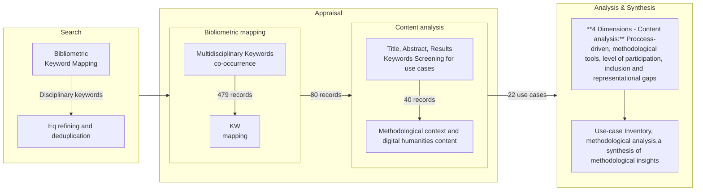

---
tags:
  - op/suggested/tutors
  - op/doc/draft
date: 2025-12-18
---

# Title: Use cases methods of user-centered designed semantic/neurosymbolic AI systems for cultural heritage and epistemic justice

# Abstract: 250w

**Acknowledgements**

The authors acknowledge the use of Perplexity AI for cross-disciplinary query refinement during the scoping review process, as referenced in the methodology section. AI-assisted language editing tools were used to improve readability. The authors take full responsibility for all content, analysis, and conclusions presented in this manuscript.

**Purpose**  
As digital libraries evolve into human-centered socio-technical ecosystems, semantic and neurosymbolic AI systems increasingly mediate access, representation, and meaning-making across cultural and knowledge domains. This article examines how users are integrated into the design and evaluation of such systems, identifying methodological trends, gaps, and opportunities for transdisciplinary collaboration. Particular attention is given to trust, accountability, and epistemic justice.

**Approach**  
As digital libraries evolve into human-centered socio-technical ecosystems, semantic and neurosymbolic AI systems increasingly mediate access, representation, and meaning-making across cultural and knowledge domains. This study examines how users and communities are integrated into the development of such systems in digital libraries, with the aim of identifying methodological trends, gaps, and opportunities for transdisciplinary collaboration. Particular attention is given to trust, accountability, and epistemic justice, including gender perspectives, intersectionality, and the representation of marginalized voices within AI-enabled digital library infrastructures.

**Findings**  
Analysis reveals three methodological trends: early user integration occurs in only seven use-cases, with most positioning users at late evaluation or continuous but narrow contribution stages; participatory approaches cluster around co-design workshops, usability testing, and crowdsourcing, yet 14 use-cases lack robust participation evaluation beyond efficiency metrics; participation levels concentrate at consultative and collaborative stages (13 use-cases), with empowerment models appearing in only five cases. Epistemic justice considerations remain largely implicit. Bias-aware modeling and provenance tracking appear in isolated cases. Evaluation practices predominantly rely on usability and information-retrieval metrics, leaving participation impacts, trust-building, and inclusion outcomes under-documented.  

**Originality**  
By systematically mapping who is involved, when, how, and with what degree of agency and epistemic responsibility, this study offers a structured analytical lens for assessing the inclusiveness, trustworthiness and accountability of human-centered AI practices in digital libraries. The resulting framework contributes to understanding digital libraries as reliable socio-technical systems within a Cultural Cyber-Critical Ecosystem and serves both as an analytical tool for researchers and a pragmatic guide for practitioners seeking to embed co-design, citizen science, and bias-aware modelling into the sustainable governance of future digital library infrastructures.

**Limitations**
Finally, this study has several **limitations** that also suggest directions for future research. The analysis is constrained by uneven documentation across use cases, a temporal focus on the past decade, and a corpus dominated by English-language and Global North use-cases, which limits generalizability. Hybrid initiatives often resist neat categorization, highlighting the need for more transparent reporting of participatory processes and evaluation methods. Future research should pursue longitudinal and comparative studies, expand geographic and linguistic coverage, and further refine methodological tools for assessing participation, trust, and epistemic justice in human-centered AI systems for digital libraries.

**Keywords:** User-centered design, participatory design, citizen science, human–computer interaction, epistemic justice, digital libraries, bibliometric analysis, SALSA, semantic web technologies, knowledge graphs, methodological analysis, gender-inclusive design.

# Introduction:

Digital libraries have shifted from technical repositories to socio-technical ecosystems where semantic and neurosymbolic AI [[Digital Humanities & Large Language Models Practice and Research in Semantic Retrieval of Ancient Documents|(Wang, H. et al., 2024)]] must serve diverse, situated communities [[Human-Centered AI  A New Synthesis   Human-Computer Interaction – INTERACT 2021|(Shneiderman, B. 2021;]][[Ciencia, cyborgs y mujeres - la reinvención de la naturaleza|Haraway, D. 1991)]]. “User-centered” is therefore a complex, context-dependent task [[Participatory_design_A_systematic_review_and_insights_for_future_practice|(Wacnik, P. et al., 2025)]] rather than a fixed recipe: roles range from co-designers to annotators, evaluators, or data subjects, and responsibilities span usability, provenance, bias mitigation, and epistemic justice.

Use-case research offers a pragmatic lens to see how methods, roles, and power interplay across concrete use-cases. Participatory indexing experiments show co-design can surface needs while exposing tensions between expert vocabularies and lived practices [[Clippings/Participatory Indexing in the Eyes of Its Potential Users- An Example of a Co-design of Participatory Services in an Academic Digital Library|(Leblanc, 2020)]]. Future-oriented Human-Computer Interaction (HCI) work argues that exploration support requires tightly coupling UX researchers, domain experts, and developers within knowledge-graph-driven workflows to avoid brittle, designer-only models [[How Should One Explore the Digital Library of the Future?|(Fox & Chandrasekar, 2021)]]. Symbolic-AI evaluation reminds that human control must be preserved alongside system autonomy to prevent opaque or unsafe behaviors, making human oversight a design requirement rather than an afterthought ([[Design and evaluation of high-quality simbolic AI systems.pdf#page=1&annotation=340R|p.1]]; [[Design and evaluation of high-quality simbolic AI systems.pdf#page=4&selection=152,0,183,3|p.4]]).

At the same time, much co-production literature remains aspirational or facilitative, pointing to gaps between methodological guidance and real power-sharing [[The politics of co-production participation, power, and transformation.pdf#page=1&annotation=540R|p.15]]. In cultural heritage, calls for decentralized curation, radical user orientation, and contextualized records suggest that standards and iterative development can broaden participation across archival processes [[Metadata and Semantic Research - Conference.pdf#page=402&annotation=11793R|p.384]]. Human-centered AI surveys underline the stakes: AI systems act on personal and trace data, with risks of inscrutable models, embedded bias (especially against minorities), privacy harms, and “illusions of meaning” when models lack accountability [[What is Human-Centered about Human-Centered AI_ A Map of the Research Landscape _ Proceedings of the 2023 CHI Conference on Human Factors in Computing Systems.pdf#page=1&selection=931,0,1057,2&color=yellow|Capel & Brereton, 2023]]. These threads converge on a core premise: user roles and methods must be matched to domain sensitivities, community agency, and social responsibility.

This article therefore frames user-centered semantic/NeSy AI for digital libraries as a situated, negotiated practice. Through a use-case analysis across 22 use-cases, we map when and how users are integrated (early vs. late, continuous vs. episodic), what methodological tools are deployed (co-design workshops, usability testing, crowdsourcing, semantic curation, AI-assisted creation), and how participation levels and epistemic justice are addressed—or left implicit. By comparing concrete implementations—from co-designed indexing services to exploratory semantic search, crowdsourced enrichment, and community-led storytelling—we trace where users appear as co-creators, evaluators, annotators, or subjects, and how methodological choices shape inclusion, bias mitigation, and accountability. The goal is to surface patterns and gaps so future digital library projects can better align methodological strategies with the situated needs and rights of the communities they intend to serve, strengthening both social responsibility and technical robustness. No prior work was found that synthesizes methodological practices across these disciplines in a comparable, multi-dimensional way, limiting direct benchmarks for contrast.

# Theoretical Framework

Digital libraries function as sociotechnical systems where semantic and neurosymbolic AI architectures, interface design, and organizational practices jointly shape what can be discovered, narrated, and contested [[How Should One Explore the Digital Library of the Future?|(Fox & Chandrasekar, 2021)]]. Within these systems, user-centered approaches encompass participatory design, human-computer interaction (HCI), citizen science, and human-centered AI (HCAI), each offering distinct methodological perspectives on how users engage with knowledge infrastructures [[The Participatory Turn in AI Design Theoretical Foundations and the Current State of Practice|(Delgado et al., 2023)]]; [[Co-creation and the new landscapes of design|(Stappers & Sanders, 2008)]]. Epistemic justice frameworks foreground how bias, representation, gender, and intersectionality shape whose knowledge is recognized and how [[Epistemic Injustice  Power and the Ethics of Knowing|(Fricker, 2007)]]; [[Ciencia, cyborgs y mujeres - la reinvención de la naturaleza|(Haraway, 1991)]], while human-centered AI scholarship highlights risks of inscrutable models, embedded bias, and "illusions of meaning" when systems lack accountability [[What is Human-Centered about Human-Centered AI_ A Map of the Research Landscape _ Proceedings of the 2023 CHI Conference on Human Factors in Computing Systems|(Capel & Brereton, 2023)]]. 
Seven key reviews further structure this theoretical framework. Systematic mappings of participatory design and its evolution [[Participatory_design_A_systematic_review_and_insights_for_future_practice|(Peter Wacnik et al., 2025)]] and the participatory turn in AI design [[The Participatory Turn in AI Design Theoretical Foundations and the Current State of Practice]] clarify how users can act as partners in configuring socio-technical systems. Design thinking and usability-testing reviews [[Design Thinking from Bibliometric Analysis to Content Analysis, Current Research Trends, and Future Research Directions]]; [[Usability Testing  A Bibliometric Analysis Based on WoS Data – Journal of Scientometric Research]] situate methodological repertoires for iterative evaluation in HCI and related fields, while a scoping review of the Wikipedia gender gap foregrounds structural patterns of exclusion and gendered bias in large-scale knowledge infrastructures [[Wikipedia gender gap a scoping review Profesional de la información]]. A structured review of neuro-symbolic AI [[Is Neuro-Symbolic AI Meeting its Promise in Natural Language Processing? A Structured Review]] and a bibliometric synthesis on semantic technologies for cultural heritage [[Semantic technology for cultural heritage a bibliometric-based review.pdf#page=11&annotation=496R|Semantictechnologyforcultural-10-1108_GKMC-04-2023-0125_230822_184919]] together anchor semantic/NeSy approaches within GLAM contexts. Taken together, these reviews frame digital libraries as contested sites where participation, epistemic justice, and representational politics must be analysed alongside technical architectures.
# Methodology:

This study adopts a qualitative-dominant mixed-methods design combining a scoping review of the scholarly literature with a systematic content analysis of selected use cases. The methodological approach is grounded in the SALSA framework (Search, Appraisal, Synthesis, Analysis), which is well established for mapping interdisciplinary research landscapes [[ChatGPT como apoyo a las systematic scoping reviews- integrando la inteligencia artificial con el framework SALSA |(Lopezosa, Carlos et al., 2024)]].

A structured literature search was conducted across academic databases covering computer science, library and information science, digital humanities, human–computer interaction, and social sciences. The SALSA framework was complemented with a bibliometric mapping process [[Literature Reviews Modern Methods for Investigating Scientific and Technological Knowledge|(Cardoso, A. P. et al., 2021)]] allowing that keywords from different fields with similar objects of study weren't missed. The search equations were built specifically to understand the intersection of semantic technologies, participatory design, and digital libraries-oriented infrastructures. Perplexity Ai, a search engine/agent that allows the discrimination of academic information, was used to refine such process [[Codina-Buscadores-alternativos - perplexity|(Codina, L. 2023)]].  

A multidisciplinary sample for analysis using a qualitative use-case inquiry with applied explicit inclusion and exclusion criteria: only peer reviewed academic publications (articles, conference papers, book chapters, books), Scopus and Web of Science indexation between 2014 and 2025 and the presence of the keywords discovered through the bibliometric process as follows. The search returned 3,270 records (after deduplication) and its keywords were studied by scientific maps technique [[Science mapping software tools_ Review, analysis, and cooperative study among tools|(Cobo, M.J. et al., 2011)]] allowing the identification of different thematic overlaps. 497 records contained keywords from at least two of the four thematic axes (cultural heritage; semantic web/neurosymbolic AI; representational gaps; and UCD/citizen science/HCI methodologies), while 80 records contained at least 8 out of 16 canonical keywords. A systematic screening process was applied to these 80 records, examining titles, abstracts, and results to assess the presence of use-cases. From this subset, 40 records were selected as objects of the study. A final appraisal to evaluate the presence of methodological context, user-centered practices, 22 use-cases were selected for detailed content analysis (see **figure 1**).

**Figure 1. Scoping Review Methodology (source: authors)

As the use cases originated from multidisciplinary literature, they express their methodological approaches in very different ways. This study proposes two general frameworks that can be used to systematically characterise them while maintaining their own general context and language. The first is the way of describing processes and tools from the design approach [[Design Thinking Process Model Review|(Waidelich, L. et al., 2018)]] [[Techniques and Methods to Evaluate Human-Centered Symbiotic AI Systems|(Miriana Calvano, 2025)]] and the other one, from the research point of view (specifically from the context of citizen science) [[The politics of co-production participation, power, and transformation|(Turnhout, E. et. al 2020)]][[ECSA's Characteristics of Citizen Science|(Haklay et al., 2020)]] as can be seen in **Table 1**.

| Dimension                                                                | Analytical Variable                                                                                                                                       | Description                                                                                                                                                      | Key References                                                                                                                                                                                                                                                                                                                                                                      |
| :----------------------------------------------------------------------- | --------------------------------------------------------------------------------------------------------------------------------------------------------- | ---------------------------------------------------------------------------------------------------------------------------------------------------------------- | ----------------------------------------------------------------------------------------------------------------------------------------------------------------------------------------------------------------------------------------------------------------------------------------------------------------------------------------------------------------------------------- |
| 1. User integration phases and process-driven patterns                   | Iterations of conceptualization, design, development, technology deployment and its ongoing evaluation and monitoring of the participation effectiveness. | Phases of a design process or a technological development                                                                                                        | [[Design Thinking Process Model Review\|(Waidelich, L. et al., 2018)]] [[Techniques and Methods to Evaluate Human-Centered Symbiotic AI Systems\|(Miriana Calvano, 2025)]]                                                                                                                                                                                                          |
|                                                                          | Research design, information gathering, field work, analysis, science communication, knowledge transference, and impact evaluation.                       | Phases of a research process which includes the citizen science approach                                                                                         | [[The politics of co-production participation, power, and transformation\|(Turnhout, E. et. al 2020)]][[ECSA's Characteristics of Citizen Science\|(Haklay et al., 2020)]]                                                                                                                                                                                                          |
|                                                                          | Early, constant, late                                                                                                                                     | If user participation is found after deployment/analysis phases, it's an early integration, otherwise it's late. Constant monitoring is also found.              | [[How Should One Explore the Digital Library of the Future?\|(Fox & Chandrasekar, 2021)]], [[Techniques and Methods to Evaluate Human-Centered Symbiotic AI Systems 1\|(Miriana Calvano, 2025)]]                                                                                                                                                                                    |
| 2. Participatory approaches and methodological tools                     | Participatory design workshops                                                                                                                            | Although is a general way of describing the activity, is commonly refered to different forms of user consultation (interviews, focus groups, hands-on workshops) | [[The Participatory Turn in AI Design Theoretical Foundations and the Current State of Practice\|(Fernando Delgado et al., 2023)]]                                                                                                                                                                                                                                                  |
|                                                                          | Co-design sessions and co-creative                                                                                                                        | Any act of collective creativity (including neurosymbolical AI tools), as the authors define.                                                                    | [[Co-creation and the new landscapes of design\|(Stappers & Sanders, 2008)]] [[Human_AI_Co_Creation_A_Framework_for_Collaborative_Design_in_Intelligent_Systems\|(Liu, Z., 2025)]]                                                                                                                                                                                                  |
|                                                                          | User testing and interface evaluation                                                                                                                     | Set of techniques used to identify specific usability issues with products.                                                                                      | [[Clippings/Usability Testing  A Bibliometric Analysis Based on WoS Data – Journal of Scientometric Research\|(Mahdie S. B. et al., 2024)]]                                                                                                                                                                                                                                         |
|                                                                          | Collective intelligence, pooling of resources, data collection, analysis tasks, serious games, participatory experiments, grassroots activities           | These are models of citizen science development defining the specific experience of the participation.                                                           | [[White Paper on Citizen Science for Europe\|(Matt, S. 2015)]]                                                                                                                                                                                                                                                                                                                      |
|                                                                          | Crowdsourcing and collective annotation and curation                                                                                                      | Its a common practice on citizen science to develop platforms for massively annotate wide corpus with non-experts.                                               | [[Cultural Heritage Information Retrieval Past Present and Future Trends\|(Babak Ranjgar et al., 2024]][[Towards a Teacher Application to Support Semantic Annotations of Learning Tasks in Cultural Heritage\|; García-Zarza, P. et al., 2022)]]                                                                                                                                  |
|                                                                          | Others                                                                                                                                                    | Other tools that can be found as participation comes from a variety of fields with its own tools.                                                                | [[Ciència Ciutadana o Ciutadanies Científiques? Quatre Models de Participació en Ciència i Tecnologia\|(Javier Gómez-Ferri, 2014)]]                                                                                                                                                                                                                                                 |
| 3. Levels of user participation and engagement                           | Consult, include, elaborate, own                                                                                                                          | Consulting is the lowest level of engagement and owning the highest.                                                                                             | [[The Participatory Turn in AI Design Theoretical Foundations and the Current State of Practice\|(Fernando Delgado et al., 2023)]]                                                                                                                                                                                                                                                  |
|                                                                          | Scientific, inspirational, educational, social, economic, environmental, political community agency                                                       | The levels of participation expressed here are impact areas of the knowledge products.                                                                           | [[White Paper on Citizen Science for Europe\|(Stephanie MATT, 2015)]] [[The Science of Citizen Science\|(Katrin Vohland et al., 2021)]]                                                                                                                                                                                                                                             |
| 4. Inclusion, representational gaps and epistemic justice considerations | Epistemic justice, gender perspectives, intersectionalities, censorships, bias recognition and mitigation                                                 | These are complementary conceptual frameworks that will be assessed in in the literature as they are expressed.                                                  | [[Epistemic Injustice  Power and the Ethics of Knowing\|(Fricker, Miranda,  2007)]][[Ciencia, cyborgs y mujeres - la reinvención de la naturaleza\|(Donna Haraway, 1991)]] [[Women Who Make a Fuss  The Unfaithful Daughters of Virginia Woolf on JSTOR\|(Isabelle Stengers & Vincianne Despret, 2014)]] |
|                                                                          | Knowledge diversity or power dynamics awareness                                                                                                           | In the literature, scientific knowledge can appear as the only one expressed, although other types need to be considered.                                        | [[Autonomía y diseño - La realización de lo comunal\|(Escobar, A. 2016)]]                                                                                                                                                                                                                                                                                                           |
|                                                                          | Model “top-down” or “bottom up”                                                                                                                           | These models are common frameworks for general participatory practices, some use-cases use "bottom up" this form for inclusion.                                  | [[Ciència Ciutadana o Ciutadanies Científiques? Quatre Models de Participació en Ciència i Tecnologia\|(Javier Gómez-Ferri, 2014)]].                                                                                                                                                                                                                                                |
|                                                                          | Provenance mechanisms, bias checks, and configurable governance models                                                                                    | These are some of the mechanisms that allow Digital library's neurosymbolic AI systems to be aware of its representational gaps.                                 | [[How Should One Explore the Digital Library of the Future?\|(Fox & Chandrasekar, 2021]] [[Techniques and Methods to Evaluate Human-Centered Symbiotic AI Systems\|;Calvano, 2025)]]                                                                                                                                                                                                |
Table 1. Analytical Codebook for Use Case Content Analysis. Source: Authors’ own data.

The process-driven lens examines when users enter system life cycles—early co-design, late evaluation, continuous engagement, or undocumented—drawing on iterative design and participatory effectiveness frameworks [[Design Thinking Process Model Review|(Waidelich, L. et al., 2018)]]; [[Techniques and Methods to Evaluate Human-Centered Symbiotic AI Systems|(Miriana Calvano, 2025)]], co-production in knowledge work [[The politics of co-production participation, power, and transformation|(Turnhout, E. et. al 2020]], and citizen-science contribution phases [[ECSA's Characteristics of Citizen Science|(Haklay et al., 2020)]]; [[Ciència Ciutadana o Ciutadanies Científiques? Quatre Models de Participació en Ciència i Tecnologia|(Javier Gómez-Ferri, 2014)]]. The methodological tools/model dimension inventories participatory design and co-creation methods [[The Participatory Turn in AI Design Theoretical Foundations and the Current State of Practice|(Fernando Delgado et al., 2023)]]; [[Co-creation and the new landscapes of design|(Stappers & Sanders, 2008)]], human–AI co-creation that aims to reduce cognitive load [[Human_AI_Co_Creation_A_Framework_for_Collaborative_Design_in_Intelligent_Systems|(Liu, Z., 2025)]], usability testing [[Clippings/Usability Testing  A Bibliometric Analysis Based on WoS Data – Journal of Scientometric Research|(Mahdie S. B. et al., 2024)]], crowdsourcing [[Cultural Heritage Information Retrieval Past Present and Future Trends|(Babak Ranjgar et al., 2024)]], and annotation/curation practices [[Towards a Teacher Application to Support Semantic Annotations of Learning Tasks in Cultural Heritage|García-Zarza, P. et al., 2022)]], alongside design-thinking and HCAI patterns [[Design Thinking Process Model Review|(Waidelich, L. et al., 2018)]]; [[What is Human-Centered about Human-Centered AI_ A Map of the Research Landscape _ Proceedings of the 2023 CHI Conference on Human Factors in Computing Systems|(Tara Capel & Margot Brereton, 2023)]]. Engagement models range from collective intelligence to grassroots experiments [[White Paper on Citizen Science for Europe|(Stephanie MATT, 2015)]]. The participation/engagement dimension aligns design spectra (consult, include, elaborate, own) [[The Participatory Turn in AI Design Theoretical Foundations and the Current State of Practice|(Fernando Delgado et al., 2023)]] with citizen-science roles (scientific, educational, social, economic, environmental, political agency) [[White Paper on Citizen Science for Europe|(Matt, S. 2015)]]; [[The Science of Citizen Science|(Katrin Vohland et al., 2021)]]. The representational gaps/epistemic justice dimension tracks gender, intersectionality, bias mitigation, knowledge diversity, and power awareness [[Epistemic Injustice  Power and the Ethics of Knowing|(Fricker, Miranda,  2007)]]; [[Ciencia, cyborgs y mujeres - la reinvención de la naturaleza|(Donna Haraway, 1991)]]; [[Women Who Make a Fuss  The Unfaithful Daughters of Virginia Woolf on JSTOR|(Isabelle Stengers & Vincianne Despret, 2014)]]; [[Autonomía y diseño - La realización de lo comunal|(Escobar, A. 2016)]]. 

# Findings about methodological user integration

The presentation of findings is explicitly structured according to the analytical codebook defined in the Methods section ==(see Table 1)==. Each subsection of the findings corresponds to one dimension with the described analytical variables for content analysis of the 22 use cases. The initial overview of the use-case set provides contextual grounding for the corpus, while the subsequent sections report results following the four coding dimensions: (i) user integration phase and process-driven patterns, (ii) participatory approaches and methodological tools, (iii) levels and types of user participation and agency, and (iv) representational gaps and epistemic justice considerations. Within each subsection, results are reported by aggregating observations across use cases coded under the same variables, enabling systematic cross-case comparison. This structure ensures traceability between the analytical framework and the empirical results, making explicit how observed patterns and gaps derive directly from the underlying coding scheme rather than from post hoc interpretation.

## 1. User integration phase and process-driven patterns

The process-driven dimension examines when in the development lifecycle users are integrated into semantic and NeSy AI systems for digital libraries, distinguishing between early-stage co-design, late-stage evaluation, constant engagement, and cases where user integration is not explicitly documented. Analysis of the 22 use-cases is non-exclusive across phases: seven use-cases integrate users early in development, five engage users primarily during late evaluation, and six report constant engagement (e.g., ongoing crowdsourcing or continuous co-curation), while four do not explicitly document the participation phase. Constant participation doesn't mean necessarily that users take part in the whole project's phases, this can be due to a process that accepts contributions continuously but in a very specific way; such as Polariscope, that is presented as an online community for everyone to contribute although the users participated mainly by testing the tool in the final design stages [[Clippings/Remixing and repurposing cultural heritage archives through a collaborative and AI-generated storytelling digital platform |(Pedro Almeida et al., 2024)]]. Another example is *PhD Students' Information-Sharing KG* (design + evaluation). This process integrates strategically interviews for understanding the system requirements, and sentiment analysis for evaluation [[Clippings/It answers questions that I didn't know I had" PhD students' evaluation of an information sharing knowledge graph| (Gardasevic & Lamba, 2024)]]. The design-led use-cases more frequently incorporating early user integration compared to research-oriented initiatives that tend toward constant monitoring or late-stage evaluation. 

## 2. Participatory approaches and methodological tools

This dimension identifies the strategic use of techniques, frameworks [[Ciència Ciutadana o Ciutadanies Científiques? Quatre Models de Participació en Ciència i Tecnologia|(Javier Gómez-Ferri, 2014)]], and approaches employed to integrate users into semantic and NeSy AI systems for digital libraries, revealing a diverse toolkit ranging from structured participatory workshops to automated knowledge extraction pipelines. Analysis of the 22 use-cases demonstrates three primary tool clusters: (i) User-centered and co-design approaches, which utilize co-construction workshops, participatory design processes, and community-led co-design sessions; (ii) user testing and user-centered design methods, (specifically as interface usability testing, requirement workshops, iterative test phases; (iii) crowdsourcing and user-generated content strategies, which leverage collaborative editing environments, crowdsourced platforms, implicit crowdsourcing through social media data collection and hackathon-based prototyping (commonly used for ontology and knowledge graph engineering methodologies). Yet most approaches (14) still lack robust participation evaluation (use-cases report efficiency/impact evaluations beyond usability/IR metrics—impact on participation remains under-documented). 
## 3. Levels of user participation and engagement

The levels of user participation and engagement map the spectrum of user consultation, decision-making power and ownership [[The Participatory Turn in AI Design Theoretical Foundations and the Current State of Practice|(Fernando Delgado et al., 2023)]] within semantic and NeSy AI systems for digital libraries, ranging from just knowledge building and scientific sphere to full community empowerment and political agency [[White Paper on Citizen Science for Europe|(Stephanie MATT, 2015)]] [[The Science of Citizen Science|(Katrin Vohland et al., 2021)]]. Analysis of the 22 use-cases reveals a concentration of use-cases at consultative and collaborative levels (13), with fewer instances of true intents of empowerment or community agency models (5). Of the five participatory use-cases that operate at the elaborate level, 3 also included other forms of engagement as consultation or inclusion, the rest only asked the user to participate to volunteer in very systematic tasks as well as two use-cases engaging on the social level (from the research point of view). Notably, two use-cases (Inuvialuit Digital Library and ArsEmotica) explicitly adopt political community agency perspectives by mixing different tools such as Interviews, user testing, surveys, demonstrations, open houses, participant observation (in person and digitally through social media). 
## 4. Inclusion, representational gaps and epistemic justice considerations

In terms of representational gaps and epistemic justice one, which assesses how use-cases surface or mitigate power, bias, and inclusion issues in semantic/NeSy AI for digital libraries [[A Knowledge Graph of Contentious Terminology for Inclusive Representation of Cultural Heritage|(Nesterov, A. et. al.2023)]]. Evidence from this study shows only a small subset makes it explicit in some way. Yanyuwa-comics case treats with indigenous language revitalization; although students, as their final user are not involved. Another cases, Inuvialuit Digital Library (community-controlled access and narratives) did work with its communities, and HyperReal experiments with platforms for multivocal curation of contents. Bias-aware modelling appears in GTDOnto (sensitive terrorism domain) and ProvKOS (tracking controversial classifications), while a few use-cases (7) signal representation aims (e.g., World Literature KG foregrounding non-Western authors) whereas not necessarily describe procedures to manage them to avoid representational gaps. 

# Discussions

The findings of this study provide a critical perspective on the current state of human-centered semantic and neurosymbolic AI practices in digital libraries, as Cultural Cyber-Critical Ecosystem. While participatory rhetoric is widespread, the empirical evidence shows that most use-cases continue to privilege technology-driven and expert-led pipelines, with limited early or sustained user involvement. 

This gap has direct implications for **trust and resilience**, as neurosymbolical AI systems that integrate users primarily at late evaluation stages risk reproducing expert-centric assumptions and opaque knowledge representations [[Co-creation and the new landscapes of design.pdf#page=2|(Stappers & Sanders, 2008;]] [[How Should One Explore the Digital Library of the Future?|Fox & Chandrasekar, 2021)]]. Trust, in this context, emerges not as a purely technical property but as a socio-technical outcome dependent on meaningful participation, transparency of design choices, and accountability of representational decisions. This is also necessary to confront HCAI challenges—inscrutable models, embedded bias against minorities, privacy risks, and “illusions of meaning”—that arise when AI systems act on personal and trace data without accountable co-design [[What is Human-Centered about Human-Centered AI_ A Map of the Research Landscape _ Proceedings of the 2023 CHI Conference on Human Factors in Computing Systems.pdf#page=1|(Capel & Brereton, 2023)]]. Embedding community governance and long-term engagement demonstrate greater capacity to respond to cultural sensitivities, contested knowledge, and evolving community needs [[Community-Driven Knowledge Organization for Cultural Heritage Digital Libraries The Case of the Inuvialuit Settlement Region|(Farnel & Shiri, 2019;]] [[Women Who Make a Fuss  The Unfaithful Daughters of Virginia Woolf on JSTOR|Stengers & Despret, 2014)]]. These cases indicate that resilience in digital libraries is not only a matter of infrastructural robustness but also of sustained social relationships and distributed responsibility.

These patterns point to a broader challenge for **transdisciplinary collaboration**. Although the analyzed use-cases draw from diverse fields—computer science, library and information science, digital humanities, HCI, and citizen science—the integration of these perspectives often remains partial. Technical development and participatory design are frequently decoupled, rather than co-evolving through shared conceptual frameworks and evaluation criteria ==(Delgado et al., 2023; Capel & Brereton, 2023)== and good practices miss the opportunity of being transferred undermining the adaptive, user-driven exploration envisioned for future digital libraries. Transdisciplinary collaboration needs to be expanded to multi-actor workflow integration advocated by Fox and Chandrasekar—explicitly linking UX researchers, subject matter experts, and developers into extensible knowledge-graph-driven workflows. This suggest that digital libraries can benefit from adaptive self-organization for diverse stakeholders [[How Should One Explore the Digital Library of the Future?|(Fox & Chandrasekar, 2021)]] but still, the processes made contribute with a perspective and learnings from its own limitations for the strengthening of the relationship between knowledge and societal relevance [[Science Communication Culture, Identity and Citizenship|(Davis, S. & Horst, M. 2016)]].

From a **practical perspective and inclusion awareness**, these results highlight the need for designers and managers of digital libraries to align participatory strategies with domain sensitivity and social responsibility. Early or continuous co-design should be prioritized in contexts involving cultural heritage, sensitive knowledge, or marginalized communities, and participatory steps should be systematically paired with evaluation methods that capture engagement quality, equity, and governance outcomes, not only usability or system performance ==(Fox & Chandrasekar, 2021; Calvano, 2025)==. Moreover, semantic and neurosymbolic AI infrastructures should embed provenance mechanisms, bias checks, and configurable governance models from the outset to support long-term trust and adaptability. If the use-cases don't express concrete safeguards such as gender/intersectionality audits, provenance of contested labels, or community governance over description practices, representational gaps stays as rhetoric with no elements for bias mitigation, culturally grounded metadata, and participatory control over meaning-making [[Ciencia, cyborgs y mujeres - la reinvención de la naturaleza|(Donna Haraway, 1991)]]. When such safeguards are absent, digital libraries risk perpetuating testimonial and hermeneutical injustices, whereby marginalized communities are included as data sources or contributors but excluded from interpretive control (Fricker, 2007; Stengers & Despret, 2014). Bias-aware modeling and provenance tracking appear only in isolated cases (e.g., ProvKOS, GTDOnto), suggesting that auditability and accountability are still treated as exceptional rather than foundational design requirements, genuine co-production is often operationalized as consultative feedback alone [[The science of citizen science.pdf#page=126&annotation=27918R|(Vohland et al., 2021)]].

Conversely, community-led initiatives demonstrate that culturally grounded metadata, multivocal narratives, and shared authority over representation can strengthen the relationship between knowledge infrastructures and societal relevance (Escobar, 2016; Davis & Horst, 2016). Hermeneutical gaps persist when marginalized groups cannot contest or define classifications, leaving their knowledge underrepresented and misinterpreted—precisely the risk when epistemic justice safeguards are absent [[Epistemic Injustice  Power and the Ethics of Knowing.pdf#page=1|(Fricker, 2011)]]; while Stengers & Despret call for epistemic disobedience so communities are not merely “spoken for” but co-author classifications and meaning [[Women Who Make a Fuss  The Unfaithful Daughters of Virginia Woolf on JSTOR|(Stengers & Despret, 2014)]].

# Conclusions

This study set out to examine how users and communities are integrated into the development of human-centered semantic and neurosymbolic AI systems in digital libraries, with the aim of identifying methodological patterns, gaps, and opportunities for future transdisciplinary collaboration. By combining a scoping review of the scholarly literature with a content analysis of 22 use cases, the paper provides an empirical and comparative perspective on participatory practices across digital library contexts.

Across the analyzed cases, the findings reveal a clear predominance of **design-led approaches**, with early co-design documented in only a limited number of initiatives, such as Yanyuwa, the PhD Students’ Knowledge Graph, Inuvialuit Digital Library, InTaVia, and ARCA. User involvement is more commonly confined to late-stage evaluation or continuous but narrowly scoped contribution models, particularly in crowdsourcing-based use-cases. Evaluation practices remain largely restricted to usability and information retrieval metrics, leaving the broader effects of participation—such as trust-building, equity, community empowerment, and long-term sustainability—under-examined.

A central contribution of this study lies in its **systematic mapping of participatory practices against epistemic justice dimensions**. Explicit attention to gender, intersectionality, bias mitigation, provenance of contested classifications, and community authority over meaning-making emerges primarily in community-led initiatives, while the majority of use-cases rely on implicit or assumed inclusivity. Where epistemic justice safeguards are absent, participatory claims risk masking persistent asymmetries of power, reinforcing testimonial and hermeneutical injustice rather than addressing it (Fricker, 2007; Haraway, 1991; Stengers & Despret, 2014). Community agency over vocabularies, metadata schemas, and access rules remains the exception rather than the norm, underscoring the need for participatory governance of knowledge representation in digital libraries.

Methodologically, the analysis highlights persistent gaps in how participatory processes are **documented, compared, and sustained**. Many use-cases provide only limited descriptions of user involvement, constraining reproducibility and cross-context transfer. Longitudinal evidence on what participatory configurations work over time is scarce, and cross-case comparison remains underdeveloped, making it difficult to assess when early co-design, late evaluation, or continuous crowdsourcing are most appropriate for different semantic or neurosymbolic AI goals. Geographic and linguistic coverage is skewed toward English-language use-cases from North America and Europe, leaving Global South perspectives under-represented and limiting generalizability.

In response to these gaps, this study contributes: (1) an empirically grounded **inventory of 22 semantic-participatory digital library initiatives**; (2) a **replicable analytical framework** spanning process phases, methodological tools, participation levels, and representational gaps; (3) a synthesis of methodological insights that evidences dominant practices and discuss about strengthening of user-centered ones still lacking comprehensible and measurable evaluation and explicit safeguards to epistemic justice and representational gaps for developing inclusive, accountable, and sustainable semantic and neurosymbolic AI infrastructures for digital libraries.

# References

![[Cited references]]