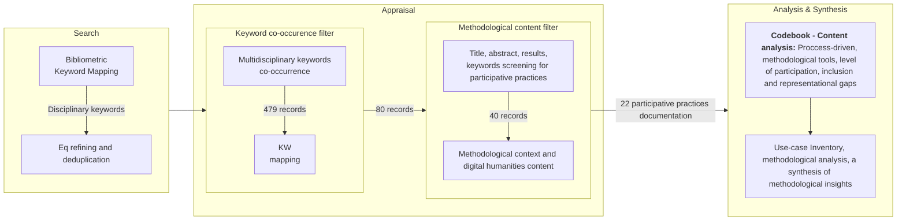

---
tags:
  - op/doc/draft
date: 2026-03-10
title: "Beyond Usability: Mapping Participatory and UCD Practices in Semantic/NeSyAI for Digital Libraries"
---

 # Beyond Usability: Mapping Participatory and UCD Practices in Semantic/NeSyAI for Digital Libraries

**Acknowledgements**

The authors acknowledge the use of Perplexity AI for cross-disciplinary query refinement during the scoping review process, as referenced in the methodology section. AI-assisted language editing tools as DeepL were used to improve readability. The authors take full responsibility for all content, analysis, and conclusions presented in this manuscript.

**Purpose**

This article examines how users and communities are integrated into the design and evaluation process of semantic and neurosymbolic information systems in digital libraries and cultural heritage. The objective is to identify and describe multidisciplinary participatory practices involved in the development of semantic or neurosymbolic information systems through a structured scoping review and content-analysis process across academic databases. identifying methodological trends, gaps, and opportunities for transdisciplinary collaboration, with particular attention to trust, accountability, and epistemic justice.

**Approach**  

The study combines a SALSA-based scoping review with bibliometric mapping and a qualitative content analysis to identify documented participatory and user-centered design (UCD) practices, and observe their methodologies in four analytical dimensions: user integration phases and process-driven patterns, participatory approaches and methodological tools, levels of user participation and engagement, and inclusion, representational gaps, and epistemic-justice considerations.

**Findings** 
Analysis reveals several methodological trends: early user integration occurs in only seven practices, with most positioning users at late evaluation or continuous but narrow contribution stages; participatory tools cluster around co-design workshops, usability testing, and crowdscience, practices lack systematic participation evaluation; participation levels concentrate at consultative and collaborative stages (13 practices), with empowerment models appearing in only five cases. Epistemic justice considerations remain largely implicit. Bias-aware modeling and provenance tracking appear in isolated practices. Evaluation practices predominantly rely on usability and information-retrieval metrics, leaving participation impacts, trust-building, and inclusion outcomes under-documented.  

**Originality**  
By systematically mapping who is involved, when, how, and with what degree of agency and epistemic responsibility, this study offers a structured analytical lens for assessing the inclusiveness, trustworthiness and accountability of human-centered semantic and AI practices in digital libraries. The resulting framework contributes to understanding digital libraries as reliable socio-technical systems within a cultural digital ecosystem ==and serves both as an analytical tool for researchers and a pragmatic guide for practitioners seeking to embed co-design, citizen science, and bias-aware modeling into the sustainable governance of future digital library infrastructures.

**Limitations**
This study has several limitations that also suggest directions for future research. The analysis is constrained by uneven documentation across practices, a temporal focus on the past decade, and a corpus dominated by English-language and Global North practices, which limits generalizability. Hybrid initiatives often resist neat categorization, highlighting the need for more transparent reporting of participatory processes and evaluation methods. Future research should pursue longitudinal and comparative studies, expand geographic and linguistic coverage, and further refine methodological tools for assessing participation, trust, and epistemic justice in human-centered AI systems for digital libraries.

**Keywords:** User-centered design, participatory design, citizen science, human–computer interaction, epistemic justice, digital libraries, bibliometric analysis, SALSA, semantic web technologies, knowledge graphs, methodological analysis, gender-inclusive design.

# Introduction

Digital libraries have shifted from technical repositories to socio-technical systems mediating access, representation, and meaning-making across cultural and knowledge domains [[Social Science Is Necessary for Operationalizing Socially Responsible Foundation Models|(Davies *et al.*, 2025)]]. A socio-technical system implies that infrastructures shape how cultural heritage is discovered, narrated, and contested [[How Should One Explore the Digital Library of the Future?|(Fox and Chandrasekar, 2021)]], raising questions about trust, accountability, and epistemic justice for diverse communities [[Human-Centered AI  A New Synthesis   Human-Computer Interaction – INTERACT 2021|(Shneiderman, 2021)]]; [[Ciencia, cyborgs y mujeres - la reinvención de la naturaleza|(Haraway, 1991)]]. Cultural heritage is a multidimensional resource [[Cultural Heritage Information Retrieval Past Present and Future Trends|(Ranjgar *et al.*, 2024)]] supporting cultural memory, diversity, local development, and well-being. In designing these infrastructures, semantic and neurosymbolic AI (NeSyAi) systems are increasingly used [[Introducing Neuro-Symbolic Artificial Intelligence to Humanities and Social Sciences Why Is It Possible and What Can Be Done?|(Wang *et al.*,2024)]]; [[Semantic technology for cultural heritage a bibliometric-based review.pdf#page=11&annotation=496R|(Desul *et al.*, 2023)]]; [[Cultural Heritage Information Retrieval Past Present and Future Trends|(Ranjgar *et al.*, 2024)]]. The semantic technologies comprise ontological models and semantic-based data repositories, portals or searchers; also knowledge graph-based systems, linked open data platforms and other specialized semantic tools for knowledge organization needs [(Garrafallou, 2021](file:///Users/elenagomez/Library/Mobile%20Documents/iCloud~md~obsidian/Documents/Drafts/Digital%20libraries/Metadata%20and%20Semantic%20Research%20-%20Conference)[;Krishna *et al.*, 2020)](file:///Users/elenagomez/Library/Mobile%20Documents/iCloud~md~obsidian/Documents/Drafts/Digital%20libraries/An%20Ontology-Based%20Chatbot%20to%20Enhance%20Experiential%20Learning%20in%20a%20Cultural%20Heritage%20Scenario-Web%20of%20Science%20Core%20Collection%201). The NeSyAI refers to their hybridization with artificial intelligence (AI) or artificial neural networks [(Huang, 2022)](Introducing_Neuro-Symbolic_Artificial_Intelligence.pdf#page=1&annotation=138R).

In addition, within digital-library projects, social participation is a complex, context-dependent task drawing on multiple disciplines. A participatory turn in AI design [[The Participatory Turn in AI Design Theoretical Foundations and the Current State of Practice|(Delgado *et al.*, 2023)]] and in cultural-heritage collections [[Engaging Communities in Cultural Heritage|(Lähdesmäki *et al.*, 2025)]] positions users as co-designers, annotators, evaluators, or data subjects, with responsibilities spanning usability, provenance, and bias mitigation. Epistemic-justice frameworks foreground how bias, representation, gender, and intersectionality [[Epistemic Injustice  Power and the Ethics of Knowing|(Fricker, 2007)]] shape whose knowledge is recognized [[Ciencia, cyborgs y mujeres - la reinvención de la naturaleza|(Haraway, 1991)]], while human-centred AI scholarship highlights risks of inscrutable models and embedded bias when systems lack accountability [[What is Human-Centered about Human-Centered AI_ A Map of the Research Landscape _ Proceedings of the 2023 CHI Conference on Human Factors in Computing Systems|(Capel and Brereton, 2023)]]. Where such safeguards are absent, participatory claims can mask persistent power asymmetries.

Existing research has examined Participatory Design (PD) practices [[A domain-independent descriptive design model and its application to structured reflection on design processes|(Reymen, I. 2001)]], co-design, and human-centred AI, showing how methods, roles, and power are configured in specific projects—e.g. participatory indexing surfaces user needs and tensions between expert vocabularies and lived practices [[Clippings/Participatory Indexing in the Eyes of Its Potential Users- An Example of a Co-design of Participatory Services in an Academic Digital Library|(Leblanc, 2020)]], while human-computer interaction (HCI) and Human-computer AI (HCAI) work stresses coupling UX researchers, domain experts, and developers in knowledge-graph workflows [[How Should One Explore the Digital Library of the Future?|(Fox and Chandrasekar, 2021)]], and symbolic/NeSyAI evaluations stress human control as a design requirement [[Design and Evaluation of High-Quality Symbiotic AI Systems through a Human-Centered Approach|(Calvano, 2024)]]. Despite this, the literature remains fragmented in how it documents and compares user integration across semantic and NeSyAI systems for cultural heritage. Approaches such as citizen science [[Engaging Communities in Cultural Heritage|(Lähdesmäki *et al.*, 2025)]]; [[The Collective Wisdom Handbook Perspectives on Crowdsourcing in Cultural Heritage - book sprint version|(Ridge *et al.*, 2021)]], PD (including UCD, HCI, HCAI) [[The Participatory Turn in AI Design Theoretical Foundations and the Current State of Practice|(Delgado *et al.*, 2023)]]; [[Co-creation and the new landscapes of design|(Stappers and Sanders, 2008)]], co-design, and design thinking  are often invoked with limited evidence of the participatory process, minimizing impact, replicability, and operationalization.

This article contributes to this problem: although such systems increasingly invoke participatory and citizen-science language, the literature documents these practices in uneven, fragmented ways—when and how users are integrated, which tools are mobilized, and how far inclusion and epistemic justice are made explicit remain unclear, limiting the design of accountable, replicable infrastructures. Two research questions therefore guide this study:

- **RQ1.**  To what extent, and in which contexts, are participatory and citizen‑science practices integrated into the design and evaluation of semantic and NeSyAi systems for digital libraries and cultural heritage?
- **RQ2.** How does the academic literature describe these participatory practices in terms of development phases, methodological tools, levels of user participation, and approaches to inclusion and epistemic justice?

This study examines 22 practices of semantic and NeSyAI systems for digital libraries and cultural heritage using the four analytical dimensions in RQ2. It aims to clarify patterns and blind spots and to offer a basis for more inclusive, accountable, and epistemically just infrastructures, supporting researchers and practitioners in aligning technical and institutional demands with the situated needs and rights of the communities concerned.

# Theoretical framework

The literature review is structured around five thematic lenses that frame the theoretical framework and analytical codebook. First, we synthesize reviews on UCD, PD and co‑production (roles, methods, power). Second, we examine user‑centred design, HCI, and human‑centred AI surveys (methodological repertoires and risks). Third, we draw on citizen‑science, crowdsourcing, and cultural‑heritage participation literature (contribution, agency, governance, shared authority). Fourth, we review semantic web and NeSy AI for cultural heritage in GLAM contexts. Fifth, we consider representational gaps, gender, and intersectionality (epistemic‑justice concerns). These lenses anchor the variables operationalized in the codebook and in the findings. Such analytical codebook (see Table 1) was built for the identification, selection, and characterization of practices in screening and content analysis, drawing on core reviews and other relevant literature containing the terminology to grasp diversity. 
The participatory turn in AI design [[The Participatory Turn in AI Design Theoretical Foundations and the Current State of Practice|(Delgado *et al.*, 2023)]] clarify how users can act as partners in configuring socio-technical systems. A structured review of NeSyAi [[Is Neuro-Symbolic AI Meeting its Promise in Natural Language Processing? A Structured Review|(Hamilton *et al.*, 2022)]] and a bibliometric synthesis on semantic technologies for cultural heritage [[Semantic technology for cultural heritage a bibliometric-based review.pdf#page=11&annotation=496R|(Desul *et al.*, 2023)]] anchor semantic and NeSyAi approaches within GLAM contexts. Systematic mappings of PD and its evolution [[Participatory_design_A_systematic_review_and_insights_for_future_practice|(Wacnik *et al.*, 2025)]] and Design thinking and usability-testing reviews [[Design Thinking  from Bibliometric Analysis to Content Analysis, Current Research Trends, and Future Research Directions|(Bhandari, 2022)]]; [[Usability Testing  A Bibliometric Analysis Based on WoS Data – Journal of Scientometric Research|(Shojaei Baghini *et al.*, 2024)]]; [[Clippings/Usability Testing  A Bibliometric Analysis Based on WoS Data – Journal of Scientometric Research|(Mahdie *et al.*, 2024)]] situate methodological repertoires for iterative evaluation in HCI and related fields. Complementing these review studies, co‑production and citizen‑science frameworks detail phases of research-design, fieldwork, communication, and impact [[The politics of co-production participation, power, and transformation|(Turnhout *et al.*, 2020)]]; [[ECSA's Characteristics of Citizen Science|(Haklay *et al.*, 2020)]]; [[White Paper on Citizen Science for Europe|(Matt, 2015)]]; [[The Science of Citizen Science|(Vohland *et al.*, 2021)]]. Design‑oriented studies on exploration support and evaluation in digital libraries specify process‑driven patterns, continuous monitoring, and engagement strategies [[How Should One Explore the Digital Library of the Future?|(Fox and Chandrasekar, 2021)]]; [[Techniques and Methods to Evaluate Human-Centered Symbiotic AI Systems|(Calvano, 2025)]]; [[Cultural Heritage Information Retrieval Past Present and Future Trends|(Ranjgar *et al.*, 2024)]] and citizen‑science participation models characterize the levels‑of‑participation [[Ciència Ciutadana o Ciutadanies Científiques? Quatre Models de Participació en Ciència i Tecnologia|(Gómez-Ferri, 2014)]]. Finally, conceptual work on participatory and co‑creative design [[Co-creation and the new landscapes of design|(Stappers and Sanders, 2008)]]; [[Human_AI_Co_Creation_A_Framework_for_Collaborative_Design_in_Intelligent_Systems|(Liu, 2025)]], and epistemic‑justice perspectives on representation and gender [[Women Who Make a Fuss  The Unfaithful Daughters of Virginia Woolf on JSTOR|(Stengers and Despret, 2014)]] inform inclusion variables and frame digital libraries as contested sites where participation, epistemic justice [[Epistemic Injustice  Power and the Ethics of Knowing|(Fricker, 2007)]], and representational identities [[Wikipedia gender gap a scoping review Profesional de la información|(Ferran-Ferrer *et al.*, 2023)]] must be analyzed alongside technical architectures [[Ciencia, cyborgs y mujeres - la reinvención de la naturaleza|(Haraway, 1991)]]. 

# Methodology

This study adopts a qualitative-dominant mixed-methods design that combines a scoping review of the scholarly literature, guided by the SALSA framework (Search, Appraisal, Synthesis, Analysis) through bibliometric techniques, followed by a systematic content analysis of the UCD - PD practices identified. Together, these procedures answer RQ1—by mapping where and how participatory and citizen‑science practices appear in semantic/NeSy AI for digital libraries and cultural heritage—and RQ2, by examining how those practices are methodologically described in academic literature.

The scoping review followed the four SALSA phases [[ChatGPT como apoyo a las systematic scoping reviews- integrando la inteligencia artificial con el framework SALSA |(Lopezosa *et al.*, 2024)]] [[Literature Reviews Modern Methods for Investigating Scientific and Technological Knowledge|(Cardoso *et al.*, 2021)]] (see Figure 1). In the **Search** phase, a structured literature search was conducted across academic databases in computer science, library and information science, digital humanities, HCI, HCAI, and design studies, using equations that combined terms for semantic and NeSyAI technologies, UCD, PD and citizen‑science approaches, digital‑library and cultural‑heritage infrastructures; Perplexity AI was used iteratively to refine search strings and avoid missing disciplinary variants of similar objects of study [[Codina-Buscadores-alternativos - perplexity|(Codina, 2023)]]. 

In the **Appraisal** phase, two filters were applied: (i) a bibliometric keyword‑co‑occurrence filter that grouped 3,270 deduplicated records from the metioned themes, retaining 497 records with keywords from at least two axes and 80 records with at least 8 of 16 canonical keywords. The second filter was a (ii) content‑based one that screened titles, abstracts, and results of these 80 records to identify concrete participatory practices; this process yielded 40 records as objects of study, of which 22 contained sufficient methodological detail. In the **Synthesis** phase, the four dimensions of the analytical codebook (see Table 1) were used to aggregate codes across these 22 practices' documents and to identify patterns and gaps in user‑integration phases, methodological tools, participation levels, and inclusion measures. In the **Analysis** phase, these aggregated patterns were interpreted in light of the five thematic lenses developed in the theoretic framework, allowing us to trace how methodological choices shape user integration, agency, and epistemic‑justice outcomes in semantic/NeSy AI for digital libraries.

Figure 1. Scoping review (SALSA + bibliometric mapping tools) + Content analysis methodology (source: authors).

Because the practices stem from multidisciplinary literature, the codebook integrates design-led (creative, developmental) and research-led (e.g. science method and citizen science) descriptions, enabling analysis under the same four dimensions without compromising interpretation. 

| Dimension                                                                | Analytical Variable                                                                                                                                       | Description                                                                                                                                                      | Key References                                                                                                                                                                                                                                                                                                                                                                                                                                                |
| :----------------------------------------------------------------------- | :-------------------------------------------------------------------------------------------------------------------------------------------------------- | :--------------------------------------------------------------------------------------------------------------------------------------------------------------- | :------------------------------------------------------------------------------------------------------------------------------------------------------------------------------------------------------------------------------------------------------------------------------------------------------------------------------------------------------------------------------------------------------------------------------------------------------------ |
| 1. User integration phases and process-driven patterns                   | Iterations of conceptualization, design, development, technology deployment and its ongoing evaluation and monitoring of the participation effectiveness. | Phases of a general design process or a technological development                                                                                                | [[Design Thinking Process Model Review\|(Waidelich *et al.*, 2018)]]; [[Techniques and Methods to Evaluate Human-Centered Symbiotic AI Systems\|(Calvano, 2025)]]                                                                                                                                                                                                                                                                                             |
| -                                                                        | Research design, information gathering, field work, analysis, science communication, knowledge transference, and impact evaluation.                       | Phases of a research process which includes the citizen science approach                                                                                         | [[The politics of co-production participation, power, and transformation\|(Turnhout *et al.*, 2020)]]; [[ECSA's Characteristics of Citizen Science\|(Haklay *et al.*, 2020)]]                                                                                                                                                                                                                                                                                 |
|                                                                          | Early, constant, late                                                                                                                                     | If user participation is found after deployment/analysis phases, it's an early integration, otherwise it's late. Constant monitoring is also found.              | [[How Should One Explore the Digital Library of the Future?\|(Fox and Chandrasekar, 2021)]], [[Techniques and Methods to Evaluate Human-Centered Symbiotic AI Systems\|(Calvano, 2025)]]                                                                                                                                                                                                                                                                      |
|                                                                          | Participatory design workshops                                                                                                                            | Although is a general way of describing the activity, is commonly refered to different forms of user consultation (interviews, focus groups, hands-on workshops) | [[The Participatory Turn in AI Design Theoretical Foundations and the Current State of Practice\|(Delgado *et al.*, 2023)]]                                                                                                                                                                                                                                                                                                                                   |
|                                                                          | Co-design sessions and co-creative                                                                                                                        | Any act of collective creativity (including neurosymbolical AI tools), as the authors define.                                                                    | [[Co-creation and the new landscapes of design\|(Stappers and Sanders, 2008)]] [[Human_AI_Co_Creation_A_Framework_for_Collaborative_Design_in_Intelligent_Systems\|(Liu, 2025)]]                                                                                                                                                                                                                                                                              |
|                                                                          | User testing and interface evaluation                                                                                                                     | Set of techniques used to identify specific usability issues with products.                                                                                      | [[Clippings/Usability Testing  A Bibliometric Analysis Based on WoS Data – Journal of Scientometric Research\|(Mahdie *et al.*, 2024)]]                                                                                                                                                                                                                                                                                                                       |
|                                                                          | Collective intelligence, pooling of resources, data collection, analysis tasks, serious games, participatory experiments, grassroots activities           | These are models of citizen science development defining the specific experience of the participation.                                                           | [[White Paper on Citizen Science for Europe\|(Matt, 2015)]]                                                                                                                                                                                                                                                                                                                                                                                                   |
|                                                                          | Crowdsourcing - crowdscience and collective indexing, annotation and content curation                                                                     | Its a common practice on citizen science to develop platforms for massively annotate wide corpus with non-experts.                                               | [[Cultural Heritage Information Retrieval Past Present and Future Trends\|(Ranjgar *et al.*, 2024)]]; [[Towards a Teacher Application to Support Semantic Annotations of Learning Tasks in Cultural Heritage\|(García-Zarza *et al.*, 2022)]] [[Engaging Communities in Cultural Heritage\|(Lähdesmäki & Thomas, 2024)]]; [[The Collective Wisdom Handbook Perspectives on Crowdsourcing in Cultural Heritage - book sprint version\|(Ridge *et al.*, 2019)]] |
|                                                                          | Others                                                                                                                                                    | Other tools that can be found as participation comes from a variety of fields with its own tools.                                                                | [[Ciència Ciutadana o Ciutadanies Científiques? Quatre Models de Participació en Ciència i Tecnologia\|(Gómez-Ferri, 2014)]]                                                                                                                                                                                                                                                                                                                                  |
| 3. Levels of user participation and engagement                           | Consult, include, elaborate, own                                                                                                                          | Consulting is the lowest level of engagement and owning the highest.                                                                                             | [[The Participatory Turn in AI Design Theoretical Foundations and the Current State of Practice\|(Delgado *et al.*, 2023)]]                                                                                                                                                                                                                                                                                                                                   |
|                                                                          | Scientific, inspirational, educational, social, economic, environmental, political community agency                                                       | The levels of participation expressed here are impact areas of the knowledge products.                                                                           | [[White Paper on Citizen Science for Europe\|(Matt, 2015)]]; [[The Science of Citizen Science\|(Vohland *et al.*, 2021)]][[Engaging Communities in Cultural Heritage\|(Lähdesmäki & Thomas, 2024)]]; [[The Collective Wisdom Handbook Perspectives on Crowdsourcing in Cultural Heritage - book sprint version\|(Ridge *et al.*, 2019)]]                                                                                                                      |
| 4. Inclusion, representational gaps and epistemic justice considerations | Epistemic justice, gender perspectives, intersectionalities, censorships, bias recognition and mitigation                                                 | These are complementary conceptual frameworks that will be assessed in in the literature as they are expressed.                                                  | [[Epistemic Injustice  Power and the Ethics of Knowing\|(Fricker, 2007)]]; [[Ciencia, cyborgs y mujeres - la reinvención de la naturaleza\|(Haraway, 1991)]]; [[Women Who Make a Fuss  The Unfaithful Daughters of Virginia Woolf on JSTOR\|(Stengers and Despret, 2014)]]; [[Wikipedia gender gap a scoping review Profesional de la información\|(Ferran-Ferrer *et al.*, 2023)]]                                                                           |
|                                                                          | Knowledge diversity or power dynamics awareness                                                                                                           | In the literature, scientific knowledge can appear as the only one expressed, although other types need to be considered.                                        | [[Autonomía y diseño - La realización de lo comunal\|(Escobar, 2016)]]                                                                                                                                                                                                                                                                                                                                                                                        |
|                                                                          | Model "top-down" or "bottom up"                                                                                                                           | These models are common frameworks for general participatory practices, some use-cases use "bottom up" this form for inclusion.                                  | [[Ciència Ciutadana o Ciutadanies Científiques? Quatre Models de Participació en Ciència i Tecnologia\|(Gómez-Ferri, 2014)]]                                                                                                                                                                                                                                                                                                                                  |
|                                                                          | Provenance mechanisms, bias checks, and configurable governance models                                                                                    | Found mechanisms that allow Digital library's NeSyAi systems to be aware of its representational gaps.                                                           | [[How Should One Explore the Digital Library of the Future?\|(Fox and Chandrasekar, 2021)]]; [[Techniques and Methods to Evaluate Human-Centered Symbiotic AI Systems\|(Calvano, 2025)]]                                                                                                                                                                                                                                                                      |
Table 1. Analytical codebook for practice content analysis. (Source: Authors’ own data).

The **user integration phases and process-driven patterns** dimension captures the moments of users entering system's design life cycles—early co-design, late evaluation, continuous engagement, or undocumented—drawing on iterative design frameworks [[Design Thinking Process Model Review|(Waidelich *et al.*, 2018)]]; [[Techniques and Methods to Evaluate Human-Centered Symbiotic AI Systems|(Calvano, 2025)]], co-production in knowledge work [[The politics of co-production participation, power, and transformation|(Turnhout *et al.*, 2020)]], and citizen-science contribution phases [[ECSA's Characteristics of Citizen Science|(Haklay *et al.*, 2020)]]. The **participatory approaches and methodological tools** dimension inventories workshops, co-design and co-creative sessions [[Co-creation and the new landscapes of design|(Stappers and Sanders, 2008)]], usability testing  [[The Participatory Turn in AI Design Theoretical Foundations and the Current State of Practice|(Delgado *et al.*, 2023)]], crowdsourcing (also named crowd-science)[[Engaging Communities in Cultural Heritage|(Lähdesmäki *et al.*, 2025)]], citizen-science models [[White Paper on Citizen Science for Europe|(Matt, 2015)]], annotation practices [[Ciència Ciutadana o Ciutadanies Científiques? Quatre Models de Participació en Ciència i Tecnologia|(Gómez-Ferri, 2014)]] and other field-specific techniques. The **levels of user participation and engagement** dimension codes design spectra (consult, include, elaborate, own) [[The Participatory Turn in AI Design Theoretical Foundations and the Current State of Practice|(Delgado *et al.*, 2023)]] with citizen-science roles (scientific, educational, social, economic, environmental, political agency) [[The Science of Citizen Science|(Vohland *et al.*, 2021)]]. Finally, the **inclusion, representational gaps and epistemic justice** dimension tracks whether and how practices address epistemic justice, gender and intersectionality [[Epistemic Injustice  Power and the Ethics of Knowing|(Fricker, 2007)]];[[Ciencia, cyborgs y mujeres - la reinvención de la naturaleza|(Haraway, 1991)]]; [[Women Who Make a Fuss  The Unfaithful Daughters of Virginia Woolf on JSTOR|(Stengers and Despret, 2014)]], knowledge diversity, power dynamics [[Autonomía y diseño - La realización de lo comunal|(Escobar, 2016)]], and technical safeguards such as provenance mechanisms, bias checks, and configurable governance models [[How Should One Explore the Digital Library of the Future?|(Fox and Chandrasekar, 2021)]]; [[Techniques and Methods to Evaluate Human-Centered Symbiotic AI Systems|(Calvano, 2025)]]; and any mention of the women problem, mirror effect, or systemic problem [[Wikipedia gender gap a scoping review Profesional de la información|(Ferran-Ferrer *et al.*, 2023)]]. The framework enables cross-practice comparison of how methodological choices shape inclusion, bias mitigation, and accountability in semantic/NeSy AI for digital libraries. Coding was at practice level The content analysis was performed by writing reading using full paper reports with direct text fragments and then systematized into a grid to compare them (see annex 1) in findings. Limitations arise where practice documentation in the literature is incomplete. 

# Findings about user integration in the design/ research processes

Results aggregate observations across practices coded under the same variables. **User integration phases and process-driven patterns.** For the 22 practices, integration is non-exclusive across phases: seven early in development, five primarily at late evaluation, six with constant engagement (e.g. ongoing crowdsourcing or co-curation), four with no explicit phase. Constant engagement often evidence contributions in specific ways rather than across all phases. *Polariscope* frames itself as a collaborative platform, although users participated mainly by testing in final stages [[Clippings/Remixing and repurposing cultural heritage archives through a collaborative and AI-generated storytelling digital platform |(Almeida *et al.*, 2024)]]. *PhD Students' Information-Sharing KG* (Knowledge graph) combines interviews for requirements and sentiment analysis for evaluation [[Clippings/It answers questions that I didn't know I had" PhD students' evaluation of an information sharing knowledge graph|(Gardasevic and Lamba, 2024)]]. Design-led practices more often integrate users early; research-oriented ones tend to constant monitoring or late-stage evaluation.

**Participatory approaches and methodological tools.** Three tool clusters emerge. (i) Co-construction workshops, participatory design, and community-led/co-design sessions appear in 16 practices—e.g. the *Yanyuwa Comic Project* used six structured workshops from narrative introduction to prototype and co-create [[Data Storytelling on Multi-modal Knowledge graph via data comics.pdf\|(Liang et al., 2024)]]. (ii) Five practices emphasize user testing and UCD tools (usability testing, requirement workshops, interviews and iterative test phases); *World Literature Knowledge Graph* was validated by "a series of structured interviews with a group of potential targets of our resource, in line with the paradigm of user-centered design" [[Clippings/The World Literature Knowledge Graph|(Stranisci et al., 2017, p. 12)]]. (iii) Crowdsourcing and user-generated content (collaborative editing, hackathon-based prototyping) feature in *Wikibase for Cultural Heritage*, *European Cultural Gems*, and *ArsEmotica*; for *Cultural Gems* the methodological tool is central—a crowdsourced platform for community-led maps and a repository of cultural and creative places [[Clippings/Cultural gems linked open data- Mapping culture and intangible heritage in European cities|(Consoli et al., 2023, p. 1)]].

**Levels of user participation and engagement.** 13 practices concentrate at consultative and collaborative levels, with five empowerment or community-agency models. *ARCA* was assessed by users and compared with other IR (information retrieval) systems [[Clippings/Design, realization, and user evaluation of the ARCA system for exploring a digital library|(Bernasconi et al., 2023, p. 1)]], i.e. consultation rather than deeper involvement. Of the five at the elaborate level, three (*ProvKOS, HyperReal, Neurosymbolic Narrative Generation for Cultural Heritage*) also show consultation or inclusion, suggesting that different participatory practices are integrated in different levels. Two practices show social-level, politically oriented community agency. Two others combine multiple tools (interviews, user testing, surveys, demonstrations, participant observation) to develop participation. *Inuvialuit Digital Library* was driven by community leaders, elders, and members involved in content choice and representation [[Clippings/Community-Driven Knowledge Organization for Cultural Heritage Digital Libraries The Case of the Inuvialuit Settlement Region|(Farnel & Shiri, 2019, p. 319)]]. *ArsEmotica* documents a participative process that both offers "emotion-driven exploration of artworks and supports a SPARQL endpoint for semantically enriched data" [[ArsEmotica for arsmeteo.org- Emotion-driven exploration of online art collections.pdf#page=4&selection=320,0,326,52|(p.4)]]. Participation itself is rarely assessed; the literature describes methods (workshops, interviews, tests) rather than evaluating them. 

**Inclusion, representational gaps and epistemic justice.** This dimension assesses how practices surface or mitigate power, bias, and inclusion [[A Knowledge Graph of Contentious Terminology for Inclusive Representation of Cultural Heritage|(Nesterov *et al.*, 2023)]]. Only a small subset makes this explicit. *Yanyuwa-comics* addresses indigenous language revitalization but did not involve students (end users) in the participative practices [[Data Storytelling on Multi-modal Knowledge graph via data comics.pdf\|(Liang et al., 2024)]], *Inuvialuit Digital Library* and *HyperReal* work with communities and multivocal curation, the latter valuing diverse perspectives on preserving and representing culture and cross-cultural interpretations of artworks [[Multivocal Exhibition Exploring Cultural Perspectives through User-Curated Art Exhibitions.pdf#page=1&selection=21,23,21,127|(p.1)]]. Bias or topic-awareness appears documented in *GTDOnto* (sensitive terrorism domain and taking certain structural decisions to experts: "answering competency questions, domain experts’ opinions, and running examples of *GTDOnto* for representing actual incidents" [[GTDOnto- An Ontology for Organizing and Modeling Knowledge about Global Terrorism|(p.1)]] and *ProvKOS* (tracking controversial classifications in the data dictionaries).

# Discussions

Taken together, the findings offer a critical perspective on the current state of human‑centred semantic and NeSy AI practices in digital libraries as part of a broader cultural cyber‑critical ecosystem. When compared with PD reviews, the distribution of user integration phases in this corpus both converges with and complicates the broader picture: like the studies summarised in Wacnik (2025) review, many projects describe stakeholder participation at multiple stages, while others confine it to specific moments in the lifecycle [[Participatory_design_A_systematic_review_and_insights_for_future_practice.pdf#page=9&selection=18,0,48,10|(Wacnik et al., 2025, p. 9)]]. At the same time, and in line with Delgado's team analysis of participatory AI design, most of the initiatives examined here implement participation through consultative modes, in which preferences and values are elicited but scope and purpose remain primarily in expert hands [[The Participatory Turn in AI Design Theoretical Foundations and the Current State of Practice.pdf#page=6&selection=170,0,176,23|(Delgado et al., 2023, p. 6)]]. In this sense, the semantic and NeSy AI practices for digital libraries replicate the broader pattern whereby participation is distributed unevenly across phases and rarely extends to co‑governance of systems, which limits their capacity to transform how cultural‑heritage infrastructures are conceived and steered.

Furthermore, the repertoire of tools identified in the methodological analysis shows a similar combination of ambition and constraint when compared with the reviews. Methodologically, the widespread use of co‑design workshops, collaborative activities, and community‑oriented processes echoes the “twin desire” diagnosed in participatory‑design literature to remedy inequitable design by engaging directly with stakeholders and users [[Participatory_design_A_systematic_review_and_insights_for_future_practice.pdf#page=2&selection=10,53,16,36|(Wacnik et al., 2025, p. 2)]]. However, the strong emphasis on user testing and interface evaluation within this corpus mirrors the bibliometric finding that usability testing has become a central methodological focus across multiple fields, including information science and library science [[Usability Testing  A Bibliometric Analysis Based on WoS Data – Journal of Scientometric Research.pdf#page=3&selection=31,0,103,9|(Mahdie et al., 2024, p. 11)]]. As Delgado's team study argue, many participatory AI projects “focus exclusively on informing selected aspects of the user interface, thereby restricting what is on the table in design negotiations" [[The Participatory Turn in AI Design Theoretical Foundations and the Current State of Practice.pdf#page=6&selection=199,40,204,1|(Delgado et al., 2023, p. 6)]]. Read through this lens, the semantic and NeSyAI practices in digital libraries appear to use a rich toolkit of participatory methods, but they seldom evaluate participation itself; instead, they mainly assess system performance and usability, which suggests that participation functions more as a technique embedded in expert‑driven workflows than as a fully theorised and measured methodological object.

In addition, the findings on inclusion and representational gaps strongly resonate with critiques of tokenistic participation and systemic bias in cultural‑heritage and knowledge‑infrastructure research. Lähdesmäki et al. show that policy pressure to adopt participatory discourses in heritage management has expanded access to official processes, yet often results in “authorised” but shallow forms of engagement that fail to grant real power or agency to communities [[Engaging Communities in Cultural Heritage.pdf#page=38&annotation=40211R|(Lähdesmäki et al., 2025, p. 19)]]. Likewise, [[Wikipedia gender gap a scoping review Profesional de la información.pdf#page=9&annotation=266R| Ferran-Ferrer et al. (2023)]] review demonstrate how the Wikipedia gender gap emerges from the interaction of the “women problem”, the “mirror effect”, and the “systemic problem”, which together reproduce inequalities in representation. The semantic and NeSy AI practices analyzed here follow a similar pattern: only a small subset makes epistemic‑justice [[Epistemic Injustice  Power and the Ethics of Knowing|(Fricker, 2007)]] concerns explicit, while most rely on implicit assumptions of inclusiveness [[Women Who Make a Fuss  The Unfaithful Daughters of Virginia Woolf on JSTOR|(Stengers and Despret, 2014)]] without detailing procedures for addressing bias, negotiating contested classifications, or ensuring community governance over vocabularies and access rules. This convergence suggests that, in the context of digital libraries, participatory rhetoric can easily mask enduring asymmetries of power [[Ciencia, cyborgs y mujeres - la reinvención de la naturaleza|(Haraway, 1991)]] unless epistemic‑justice safeguards are structurally integrated into semantic and NeSyAI systems.

Finally, the implications for trust and resilience derived from this study align closely with human‑centred AI critiques and with work [[Social Science Is Necessary for Operationalizing Socially Responsible Foundation Models|(Davies *et al.*, 2025)]] on community‑driven knowledge organization and science communication. Human‑centred AI surveys underscore that problems such as inscrutable models, embedded bias, privacy risks, and “illusions of meaning” cannot be resolved solely through technical fixes when AI systems act on personal and trace data without accountable co‑design [[What is Human-Centered about Human-Centered AI_ A Map of the Research Landscape _ Proceedings of the 2023 CHI Conference on Human Factors in Computing Systems.pdf#page=1|(Capel and Brereton, 2023)]]. Instead, trust is framed as a socio‑technical outcome grounded in meaningful participation, transparency of design choices, and accountability for representational decisions [[Co-creation and the new landscapes of design.pdf#page=2|(Stappers and Sanders, 2008)]]; [[How Should One Explore the Digital Library of the Future?|(Fox and Chandrasekar, 2021)]]. Complementary perspectives from community‑driven heritage organization [[Community-Driven Knowledge Organization for Cultural Heritage Digital Libraries The Case of the Inuvialuit Settlement Region|(Farnel and Shiri, 2019)]] and science‑communication studies emphasize that resilient cultural‑heritage infrastructures depend on sustained social relationships, shared authority, and culturally grounded practices [[Autonomía y diseño - La realización de lo comunal|(Escobar, 2016)]] as much as on robust technology [[Science Communication Culture, Identity and Citizenship|(Davis and Horst, 2016)]]. Against this backdrop, the semantic and NeSyAI practices documented in this article point to a clear agenda for digital libraries: aligning participatory strategies with domain sensitivity, pairing participatory methods with explicit evaluations of engagement and governance outcomes, and embedding provenance mechanisms, bias checks, and community‑centred governance from the outset are necessary steps to move from consultative to genuinely co‑produced semantic and NeSy AI infrastructures in cultural‑heritage contexts.

# Conclusions

By combining a scoping review of the scholarly literature with a content analysis of 22 practices, this study examined how users and communities are integrated into the development of human-centered semantic and NeSyAi systems in digital libraries, identifying methodological patterns, gaps, and opportunities for future transdisciplinary collaboration.

Across the analyzed cases, the findings reveal a clear predominance of design-led approaches, with early co-design documented in only a limited number of initiatives. User involvement is more commonly confined to late-stage evaluation or continuous but narrowly scoped contribution models, particularly in crowdsourcing-based practices. Evaluation practices remain largely restricted to usability and information retrieval metrics, leaving the broader effects of participation—such as trust-building, equity, community empowerment, and long-term sustainability—under-examined.

A central contribution of this study lies in its systematic mapping of participatory practices against epistemic justice dimensions. Explicit attention to gender, intersectionality, bias mitigation, provenance of contested classifications, and community authority over meaning-making emerges primarily in community-led initiatives, while the majority of practices rely on implicit or assumed inclusivity [[Women Who Make a Fuss  The Unfaithful Daughters of Virginia Woolf on JSTOR|(Stengers and Despret, 2014)]]. Where epistemic justice safeguards are absent, participatory claims risk masking persistent asymmetries of power [[Ciencia, cyborgs y mujeres - la reinvención de la naturaleza|(Haraway, 1991)]], reinforcing testimonial and hermeneutical injustice rather than addressing it [[Epistemic Injustice  Power and the Ethics of Knowing|(Fricker, 2007)]]. Community agency over vocabularies, metadata schemas, and access rules remains the exception rather than the norm, underscoring the need for participatory governance of knowledge representation in digital libraries.

Methodologically, the analysis highlights persistent gaps in how participatory processes are documented, compared, and sustained. Many practices provide only limited descriptions of user involvement, constraining reproducibility and cross-context transfer and none explicitly evaluate the practices themselves. Longitudinal evidence on what participatory configurations work over time is scarce, and cross-case comparison remains underdeveloped, making it difficult to assess when early co-design, late evaluation, or continuous crowdsourcing are most appropriate for different semantic or NeSyAi goals. Geographic and linguistic coverage is skewed toward English-language practices from North America and Europe, leaving Global South perspectives under-represented and limiting generalizability.

In response to these gaps, this study contributes: (i) an characterized inventory of 22 semantic/NeSyAi-participatory digital library practices; (ii) a replicable analytical framework spanning process phases, methodological tools, participation levels, and representational gaps; (iii) a synthesis of methodological insights that evidences dominant practices and discusses strengthening of user-centered ones still lacking comprehensible and measurable evaluation and explicit safeguards to epistemic justice and representational gaps for developing inclusive, accountable, and sustainable semantic and NeSyAi infrastructures for digital libraries.

# References

Almeida, P., Teixeira, A., Velhinho, A., Raposo, R., Silva, T. and Pedro, L. (2024), "Remixing and repurposing cultural heritage archives through a collaborative and AI-generated storytelling digital platform", *Proceedings of the 2024 ACM International Conference on Interactive Media Experiences Workshops*, pp.100-104. https://doi.org/10.1145/3672406.3672419

Bhandari, A. (2022), "Design Thinking from Bibliometric Analysis to Content Analysis, Current Research Trends, and Future Research Directions", *Journal of the Knowledge Economy*, Vol. 14 No. 3, pp.3097-3152. https://doi.org/10.1007/s13132-022-00920-3

Baghini, M., Mohammadi, M. and Norouzkhani, N. (2024), "Usability Testing: A Bibliometric Analysis Based on WoS Data", *Journal of Scientometric Research*, Vol. 13 No. 1, pp.09-24. https://doi.org/10.5530/jscires.13.1.2

Calvano, M. (2024), "Design and Evaluation of High-Quality Symbiotic AI Systems through a Human-Centered Approach", *Proceedings of the 28th International Conference on Evaluation and Assessment in Software Engineering*, pp.488-493. https://doi.org/10.1145/3661167.3661223

Calvano, M. (2025), "Techniques and Methods to Evaluate Human-Centered Symbiotic AI Systems", *Companion Proceedings of the 30th International Conference on Intelligent User Interfaces*. https://doi.org/10.1145/3708557.3716153

Capel, T. and Brereton, M. (2023), "What is Human-Centered about Human-Centered AI? A Map of the Research Landscape", *Proceedings of the 2023 CHI Conference on Human Factors in Computing Systems*, pp.1-23. https://doi.org/10.1145/3544548.3580959

Cardoso, A.P., Lacerda, D.P., Morandi, M.I.W.M. and Gauss, L. (2021), *Literature Reviews Modern Methods for Investigating Scientific and Technological Knowledge*, Springer. https://doi.org/10.1007/978-3-030-75722-9

Cobo, M.J., López-Herrera, A.G., Herrera-Viedma, E. and Herrera, F. (2011), "Science mapping software tools: Review, analysis, and cooperative study among tools", *Journal of the American Society for Information Science and Technology*, Vol. 62 No. 7, pp.1382-1402. https://doi.org/10.1002/asi.21525

Codina, L. (2023), "Buscadores alternativos a Google con IA generativa: análisis de You.com, Perplexity AI y Bing Chat", *Infonomy*, Vol. 1 No. 1. https://doi.org/10.3145/infonomy.23.002

Desul, S., Mahapatra, R.K., Patra, R.K., Sethy, M. and Pandey, N. (2023), "Semantic technology for cultural heritage: a bibliometric-based review", *Global Knowledge, Memory and Communication*. https://doi.org/10.1108/GKMC-04-2023-0125

Davis, S.R. and Horst, M. (2016), *Science Communication Culture, Identity and Citizenship*, Palgrave Macmillan, London.

Delgado, F., Yang, S., Madaio, M. and Yang, Q. (2023), "The Participatory Turn in AI Design: Theoretical Foundations and the Current State of Practice", *Equity and Access in Algorithms, Mechanisms, and Optimization*, pp.1-23. https://doi.org/10.1145/3617694.3623261

Escobar, A. (2016), *Autonomía y diseño: La realización de lo comunal*, Editorial Universidad del Cauca.

Davies, A., Nguyen, E., Simeone, M., Johnston, E. and Gubri, M. (2025), "Social Science Is Necessary for Operationalizing Socially Responsible Foundation Models", *arXiv preprint*, arXiv:2412.16355. https://doi.org/10.48550/arXiv.2412.16355

Farnel, S. and Shiri, A. (2019), "Community-Driven Knowledge Organization for Cultural Heritage Digital Libraries: The Case of the Inuvialuit Settlement Region", *Advances in Classification Research Online*, Vol. 29 No. 1. https://doi.org/10.7152/acro.v29i1.15453

Ferran-Ferrer, N., Boté-Vericad, J.-J. and Minguillón, J. (2022), "Wikipedia gender gap: a scoping review", *Profesional de la información*, Vol. 32 No. 6, e320617. https://doi.org/10.3145/epi.2023.nov.17

Fox, E.A. and Chandrasekar, P. (2021), "How Should One Explore the Digital Library of the Future?", *Data and Information Management*. https://doi.org/10.2478/dim-2021-0003

Fricker, M. (2007), *Epistemic Injustice: Power and the Ethics of Knowing*, Oxford University Press, Oxford.

García‑Zarza, P., Boté‑Lorenzo, M.L., Vega‑Gorgojo, G. and Asensio‑Pérez, J.I. (2022), "Towards a teacher application to support semantic annotations of learning tasks in cultural heritage", in _Proceedings of the Ninth ACM Conference on Learning @ Scale_, Association for Computing Machinery, New York, NY, pp.436-440. [https://doi.org/10.1145/3491140.3528335](https://doi.org/10.1145/3491140.3528335)

Garoufallou, E., Ovalle-Perandones, M.-A. and Vlachidis, A. (Eds.) (2021), *Metadata and Semantic Research: 15th International Conference, MTSR 2021*, Springer. https://doi.org/10.1007/978-3-030-98876-0

Gardasevic, S. and Lamba, M. (2024), "It answers questions that I didn't know I had: PhD students' evaluation of an information sharing knowledge graph", *Digital Library Perspectives*, Vol. 40 No. 4. https://doi.org/0.1108/DLP-02-2024-0025

Gómez-Ferri, J. (2014), "Ciència Ciutadana o Ciutadanies Científiques? Quatre Models de Participació en Ciència i Tecnologia", *International Journal of Deliberative Mechanisms in Science*, Vol. 3 No. 1, pp.24-48. http://dx.doi.org/10.4471/demesci.2014.13

Haklay, M. *et al.* (2020), "ECSA's Characteristics of Citizen Science", available at: https://zenodo.org/records/3758668 (accessed 1 April 2020).

Haraway, D. (1991), *Ciencia, cyborgs y mujeres: la reinvención de la naturaleza*, Ediciones Cátedra, Madrid.

Hamilton, K., Nayak, A., Božić, B. and Longo, L. (2022), "Is Neuro-Symbolic AI Meeting its Promise in Natural Language Processing? A Structured Review", *Semantic Web*. https://doi.org/10.3233/SW-223228

Huang, Z. (2022), "Introducing neuro-symbolic artificial intelligence to humanities and social sciences: why is it possible and what can be done?", _TEM Journal - Technology, Education, Management, Informatics_, Vol. 11 No. 4, pp.1863-1870. [https://doi.org/10.18421/TEM114-54](https://doi.org/10.18421/TEM114-54)

Lähdesmäki, T., Turunen, J., Terian, A. and Garcia-Bardidia, R. (Eds.) (2025), *Engaging communities in cultural heritage*, Routledge.

Leblanc, E. (2020), "Participatory Indexing in the Eyes of Its Potential Users: An Example of a Co-design of Participatory Services in an Academic Digital Library", in Hall, M., Mercun, T., Risse, T. and Duchateau, F. (Ed.s), *Digital Libraries for Open Knowledge: 24th International Conference on Theory and Practice of Digital Libraries, TPDL 2020*, Springer, pp.163-178. https://doi.org/10.1007/978-3-030-54956-5_12

Liang, Z., Zeng, Z., Fernandez-Nieto, G., Li, Y., Tsai, Y.-S., Chen, G., Swiecki, Z., Gašević, D., Bradley, J., & Sha, L. (2024). Data Storytelling on Multi-modal Knowledge Graph via Data Comics: A case study in Yanyuwa Language. *Lecture Notes in Computer Science*. https://doi.org/10.1007/978-3-031-20309-1_2

Liu, Z. (2025), "Human-AI Co-Creation: A Framework for Collaborative Design in Intelligent Systems", *AHFE 2025*. Preprint.

Lopezosa, C., Codina, L. and Ferran-Ferrer, N. (2024), "ChatGPT como apoyo a las systematic scoping reviews: integrando la inteligencia artificial con el framework SALSA", *Col·lecció del CRICC*. https://diposit.ub.edu/dspace/handle/2445/193691

Mahdie, S.B., Mohammadi, M. and Norouzkhani, N. (2024), "Usability Testing: A Bibliometric Analysis Based on WoS Data", *Journal of Scientometric Research*, Vol. 13 No. 1, pp.09-24. https://doi.org/10.5530/jscires.13.1.2

Matt, S. (2015), *White Paper on Citizen Science*, European Commission, available at: https://ec.europa.eu/futurium/en/content/white-paper-citizen-science.html (accessed 1 October 2015).

Nesterov, A., Hollink, L., van Erp, M. and van Ossenbruggen, J. (2023), "A Knowledge Graph of Contentious Terminology for Inclusive Representation of Cultural Heritage", in Pesquita, C., Jimenez-Ruiz, E., McCusker, J., Faria, D., Dragoni, M., Dimou, A., Troncy, R. and Hertling, S. (Ed.s), *The Semantic Web: 20th International Conference, ESWC 2023, Hersonissos, Crete, Greece, May 28–June 1, 2023, Proceedings*, Springer Nature Switzerland, Cham, pp.502-519. https://doi.org/10.1007/978-3-031-33455-9_30

Ranjgar, B., Sadeghi‐Niaraki, A., Shakeri, M., Rahimi, F. and Choi, S.-M. (2024), "Cultural Heritage Information Retrieval: Past, Present, and Future Trends", *IEEE Access*, Vol. 12, pp.42992-43026.

Reymen, I. (2001), *Improving design processes through structured reflection: A domain-independent approach*, Doctoral dissertation, Eindhoven University of Technology.

Ridge, M., Blickhan, S. and Ferriter, M. (Eds.) (2021), *The collective wisdom handbook: Perspectives on crowdsourcing in cultural heritage (book sprint version)*, British Library.

Shneiderman, B. (2021), "Human-Centered AI: A New Synthesis", in Ardito, C. *et al.* (Ed.s), *Human-Computer Interaction – INTERACT 2021*, Springer, pp.3-8. https://doi.org/10.1007/978-3-030-85623-6_1

Stappers, P.J. and Sanders, E.B.-N. (2008), "Co-creation and the new landscapes of design", *CoDesign*, Vol. 4 No. 1, pp.5-18. https://doi.org/10.1080/15710880701875068

Stengers, I. and Despret, V. (2014), "Women Who Make a Fuss: The Unfaithful Daughters of Virginia Woolf", available at: https://www-jstor-org.sire.ub.edu/stable/10.5749/j.ctt17xr4t9

Turnhout, E., Metze, T., Wyborn, C., Klenk, N. and Louder, E. (2020), "The politics of co-production: participation, power, and transformation", *Current Opinion in Environmental Sustainability*, Vol. 42, pp.15-21. https://doi.org/10.1016/j.cosust.2019.11.009

Vohland, K. *et al.* (Eds.) (2021), *The Science of Citizen Science*, Springer. https://doi.org/10.1007/978-3-030-58278-4

Wacnik, P., Daly, S. and Verma, A. (2025), "Participatory design: a systematic review and insights for future practice", *Design Science*, Vol. 11. https://doi.org/10.1017/dsj.2025.10009

Waidelich, L., Richter, A., Kolmel, B. and Bulander, R. (2018), "Design Thinking Process Model Review", *2018 IEEE International Conference on Engineering, Technology and Innovation (ICE/ITMC)*, pp.1-9. https://doi.org/10.1109/ice.2018.8436281

Wang, H. *et al.* (2024), "Digital Humanities & Large Language Models: Practice and Research in Semantic Retrieval of Ancient Documents", *Journal of Library and Information Science in Agriculture*. https://doi.org/10.13998/j.cnki.issn1002-1248.24-0615

