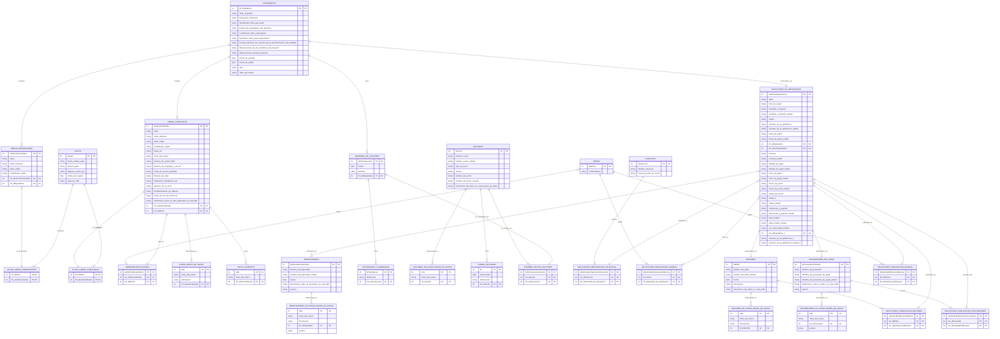

```mermaid
erDiagram
    AUTOR {
        int idAutor PK "PK"
        string Titulo_nombre_autor
        string Genero_autor
        string Registro_escrito_por
        date Fecha_del_registro
        string Alias_de_URL
    }

    AUTOR_LIBROS_PRESENTADOS {
        int FK_idAutor PK, FK
        int FK_LibroPresentado PK, FK
    }

    LIBROS_PRESENTADOS {
        int idLibrosPresentados PK "PK"
        string Titulo
        string Titulo_Uniforme
        string Autor_citado
        string Contribuidor_citado
        int FK_idLibrosPresentados FK "FK"
        int FK_idExpediente FK "FK"
    }

    AUTOR_LIBROS_PUBLICADOS {
        int FK_idAutor PK, FK
        int FK_idLibroPublicado PK, FK
    }

    LIBROS_PUBLICADOS {
        int idLibrosPublicados PK "PK"
        string Titulo
        string Titulo_Uniforme
        string Autor_citado
        string Contribuidor_citado
        string Sema_As
        string Texto_del_enlace
        string Numero_de_control_BNE
        string Numero_de_Copyright_o_de_DL
        string Punto_de_acceso_principal
        string Mencion_de_titulo
        string Publicacion_distribucion_etc
        string Mencion_de_la_serie
        string Encabezamiento_de_Materia
        string Punto_de_Acceso_adicional
        string Informacion_sobre_la_obra_publicada_en_otras_BD
        int FK_idLibroPublicado FK "FK"
        int FK_idIdioma FK "FK"
    }
    
    LIBROPUBLICADO_IDIOMA {
        int idLibroPublicadoIdioma PK "PK"
        int FK_idLibroPublicado FK "FK"
        int FK_idIdioma FK "FK"
    }

    OTRAS_BASES_DE_DATOS {
        int URL PK "PK"
        string Texto_del_enlace
        string Informacion
        int FK_idLibroPublicado FK "FK"
    }

    TEXTO_COMPLETO {
        int URL PK "PK"
        string Texto_del_enlace
        int FK_idLibroPublicado FK "FK"
    }

    EXPEDIENTES {
        int ID_Expediente PK "PK"
        string Titulo_expedient
        string Resolucion_resolucion
        string Identificador_AHA_ead_unitid
        string Estado_del_expediente_ead_phystech
        string Localizacion_fisica_ead_physloc
        string Expedient_conte_ead_scopecontent
        string Fechas_extremas_de_creacion_de_la_documentacion_ead_unitdate
        string Observaciones_de_los_miembros_del_proyecto
        string Observaciones_usuarios_proyecto
        date Fecha_de_entrada
        date Fecha_de_salida
        string URL
        string Texto_del_enlace
    }

    SOLICITUDES_DE_IMPORTACION {
        int idSolicitudImportacion PK "PK"
        string Titulo
        string Pais_de_origen
        string Cantidad_a_importar
        string Cantidad_a_importar_estado
        string Tirada
        string Caracter_de_la_publicacion
        string Caracter_de_la_publicacion_estado
        string Clase_de_papel
        string Clase_de_papel_estado
        int FK_idExpediente FK "FK"
        int FK_informeSolicitante FK "FK"
        string Formato
        string Formato_estado
        string Medida_de_papel
        string Medida_de_papel_estado
        string Peso_de_papel
        string Peso_de_papel_estado
        string Precio_de_venta
        string Precio_de_venta_estado
        string Rango_de_precio
        string Tirada_2
        string Tirada_estado
        string Volumenes_y_paginas
        string Volumenes_y_paginas_estado
        string Mota_Politico
        string Mota_Politico_estado
        string sel_Lector_Mota_Politico
        int FK_idExpediente_2 FK "FK"
        string Caracter_de_la_publicacion_2
        string Caracter_de_la_publicacion_estado_2
    }
    
    IMPORTADORES {
        int idImportadorSoliictante PK "PK"
        string Nombre_del_importador
        string Nombre_del_importador_estado
        date Fecha
        string Informacion_sobre_el_proveedor_en_otros_BD
        string Genero
    }
    
    IMPORTADORES_EN_OTRAS_BASES_DE_DATOS {
        int URL PK "PK"
        string Texto_del_enlace
        string Informacion
        int FK_idImportador FK "FK"
        string Genero
    }

    TACHADURAS_Y_ENMIENDAS {
        int idTachaduras PK "PK"
        string Referencia
        int FK_InformeLector FK "FK"
    }

    LECTORES {
        int idLector PK "PK"
        string Nombre_Lector
        string Nombre_Lector_estado
        string Tipo_de_lector
        string Genero
        string Nombre_del_lector
        string Nombre_del_lector_resuelto
        string Informacion_del_lector_en_otras_bases_de_datos
    }
    
    LECTORES_EN_OTRAS_BASES_DE_DATOS {
        int URL PK "PK"
        string Texto_del_enlace
        int FK_idLector FK "FK"
    }

    FIRMAS_LECTORES {
        int Id PK "PK"
        date Fecha_firma
        string Informacion
        int FK_idLector FK "FK"
    }
    
    INFORMES_DE_LECTORES {
        int idInformesLector PK "PK"
        date Fecha
        string Nombre
        int FK_idExpediente FK "FK"
    }

    INFORME_LECTOR_LECTORES {
        int idInformeLectorLectores PK "PK"
        int FK_idLector FK "FK"
        int FK_InformeLector FK "FK"
    }
    
    COLECCION {
        int idColeccion PK "PK"
        string Nombre_coleccion
        string Coleccion_web_de_voces
    }

    SOLICITUDES_IMPORTACION_COLECCION {
        int idSolicitudesImportacionColeccion PK "PK"
        int FK_idColeccion FK "FK"
        int FK_idSolicitud_de_importacion FK "FK"
    }
    
    IDIOMA {
        int idIdioma PK "PK"
        string nombreIdioma
    }
    
    SOLICITUDES_IMPORTACION_IDIOMAS {
        int idSolicitudesImportacionIdiomas PK "PK"
        int FK_idoma FK "FK"
        int FK_idSolicitud_de_importacion FK "FK"
    }
    
    EDITORES {
        int idEditor PK "PK"
        string Nombre_del_editor
        string Nombre_del_editor_estado
        date Fecha
        string Informacion
        string Informacion_del_editor_en_otras_bdd
    }
    
    EDITORES_EN_OTRAS_BASES_DE_DATOS {
        int URL PK "PK"
        string Texto_del_enlace
        string Informacion
        int FK_EDITOR FK "FK"
    }
    
    PROVEEDORES_DEL_PAPEL {
        int idProveedorSolicitante PK "PK"
        string Nombre_del_proveedor
        string Nombre_del_proveedor_de_papel
        string Nombre_del_proveedor_de_papel_estado
        string Informacion_sobre_el_editor_en_otras_bdd
        string Genero
    }
    
    PROVEEDORES_EN_OTRAS_BASES_DE_DATOS {
        int URL PK "PK"
        string Texto_del_enlace
        int FK_idProveedor FK "FK"
        string Genero
    }
    
    SOLICITUDES_PUBLICACION_IDIOMAS {
        int idSolicitudPublicacionIdiomas PK "PK"
        int FK_idIdioma FK "FK"
        int FK_idSolicitud_Publicacion FK "FK"
    }
    
    SOLICITUDES_PUBLICACION_EDITORES {
        int idSolcitudPublicacionEditores PK "PK"
        int FK_idEditor FK "FK"
        int FK_idSolicitud_Publicacion FK "FK"
    }
    
    SOLICITUDES_PUBLICACION_PROVEEDORES {
        int idSolicitudPublicacionProveedores PK "PK"
        int FK_idProveedor FK "FK"
        int FK_idSolicitudPublicacion FK "FK"
    }
    
    AUTOR                               ||--|{ AUTOR_LIBROS_PRESENTADOS : "presenta"
    LIBROS_PRESENTADOS                  }|--|| AUTOR_LIBROS_PRESENTADOS : "es_presentado"
    AUTOR                               ||--|{ AUTOR_LIBROS_PUBLICADOS : "publica"
    LIBROS_PUBLICADOS                   }|--|| AUTOR_LIBROS_PUBLICADOS : "es_publicado"
    LIBROS_PUBLICADOS                   ||--o{ OTRAS_BASES_DE_DATOS : "referenciado_en"
    LIBROS_PUBLICADOS                   ||--o{ TEXTO_COMPLETO : "tiene"
    LIBROS_PUBLICADOS                   ||--|{ LIBROPUBLICADO_IDIOMA : "esta_en"
    IDIOMA                              }|--o| LIBROPUBLICADO_IDIOMA : "define"
    EXPEDIENTES                         ||--|{ LIBROS_PRESENTADOS : "contiene"
    EXPEDIENTES                         ||--|{ LIBROS_PUBLICADOS : "contiene"
    EXPEDIENTES                         ||--|{ SOLICITUDES_DE_IMPORTACION : "relacionado_con"
    EXPEDIENTES                         ||--o{ INFORMES_DE_LECTORES : "tiene"
    SOLICITUDES_DE_IMPORTACION          ||--o{ IMPORTADORES : "solicitado_por"
    IMPORTADORES                        ||--o{ IMPORTADORES_EN_OTRAS_BASES_DE_DATOS : "referenciado_en"
    INFORMES_DE_LECTORES                ||--o{ TACHADURAS_Y_ENMIENDAS : "tiene"
    INFORMES_DE_LECTORES                }|--|| INFORME_LECTOR_LECTORES : "es_compuesto_por"
    LECTORES                            ||--|{ INFORME_LECTOR_LECTORES : "es_escrito_por"
    LECTORES                            ||--o{ LECTORES_EN_OTRAS_BASES_DE_DATOS : "referenciado_en"
    LECTORES                            ||--o{ FIRMAS_LECTORES : "firma"
    SOLICITUDES_DE_IMPORTACION          }|--|| SOLICITUDES_IMPORTACION_COLECCION : "pertenece_a"
    COLECCION                           ||--|{ SOLICITUDES_IMPORTACION_COLECCION : "agrupa"
    SOLICITUDES_DE_IMPORTACION          }|--|| SOLICITUDES_IMPORTACION_IDIOMAS : "esta_en"
    IDIOMA                              ||--|{ SOLICITUDES_IMPORTACION_IDIOMAS : "define"
    SOLICITUDES_DE_IMPORTACION          ||--|| EDITORES : "relacionado_con"
    EDITORES                            ||--o{ EDITORES_EN_OTRAS_BASES_DE_DATOS : "referenciado_en"
    SOLICITUDES_DE_IMPORTACION          ||--|| PROVEEDORES_DEL_PAPEL : "relacionado_con"
    PROVEEDORES_DEL_PAPEL               ||--o{ PROVEEDORES_EN_OTRAS_BASES_DE_DATOS : "referenciado_en"
    SOLICITUDES_DE_IMPORTACION          }|--o| SOLICITUDES_PUBLICACION_IDIOMAS : "publicado_en"
    IDIOMA                              ||--|{ SOLICITUDES_PUBLICACION_IDIOMAS : "define"
    SOLICITUDES_DE_IMPORTACION          }|--o| SOLICITUDES_PUBLICACION_EDITORES : "publicado_por"
    EDITORES                            ||--|{ SOLICITUDES_PUBLICACION_EDITORES : "publica"
    SOLICITUDES_DE_IMPORTACION          }|--o| SOLICITUDES_PUBLICACION_PROVEEDORES : "proveido_por"
    PROVEEDORES_DEL_PAPEL               ||--|{ SOLICITUDES_PUBLICACION_PROVEEDORES : "provee"
```