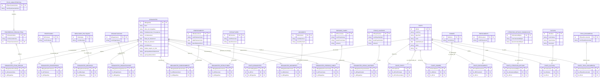

```mermaid
erDiagram
    BRIGADISTES {
        int IdBrigadista PK "PK"
        string Nom
        string Alies_del_brigadista
        string PaisNaixement_Procedencia
        string LlocNaixement
        date Data_de_Naixement
        date Data_de_defuncio
        string LlocDefuncio
        string Dades_segons_la_font
        string geologcalitzacioNaixement
        string geologcalitzacioMort
    }

    PROFESSIONS {
        int idProfessio PK "PK"
        string nomProfessio
    }

    BRIGADISTES_PROFESSIONS {
        int idBrigadistesProfessions PK "PK"
        int fk_idProfessio FK "FK"
        int fk_idBrigadista FK "FK"
    }

    PROCEDENCIA_RELIGIO_ETNIA {
        int idCaracteristica PK "PK"
        string nomCaracteristica
        int fkTipusCaracteristica FK "FK"
    }

    BRIGADISTES_ETNIA_RELIGIO {
        int idBrigadistesEtniaReligio PK "PK"
        int fk_idCaracteristica FK "FK"
        int fk_idBrigadista FK "FK"
    }

    TIPUS_CARACTERISTICA {
        int idTipusCaracteristica PK "PK"
        string nomTipusCaracteristica
    }

    IDEOLOGIES_POLITIQUES {
        int idIdeologia PK "PK"
        string nomIdeologia
    }

    BRIGADISTES_IDEOLOGIA {
        int idBrigadistesIdeologia PK "PK"
        int fk_idIdeologia FK "FK"
        int fk_idBrigadista FK "FK"
    }

    ORGANITZACIONS {
        int idOrganitzacio PK "PK"
        string nomOrganitzacio
    }

    BRIGADISTES_ORGANITZACIONS {
        int idBrigadistesOrganitzacions PK "PK"
        int fk_idOrganitzacio FK "FK"
        int fk_idBrigadista FK "FK"
    }

    ESDEVENIMENTS {
        int idEsdeveniment PK "PK"
        string nomEsdeveniment
        date dataEsdeveniment
        string tipusEsdeveniment
    }

    BRIGADISTES_ESDEVENIMENTS {
        int idBrigadistesEsdeveniments PK "PK"
        int fk_idEsdeveniment FK "FK"
        int fk_idBrigadista FK "FK"
    }

    ESTRUCTURES {
        int idEstructura PK "PK"
        string nomEstructura
        string tipusEstructura
    }

    BRIGADISTES_ESTRUCTURES {
        int idBrigadistesEstructures PK "PK"
        int fk_idEstructura FK "FK"
        int fk_idBrigadista FK "FK"
    }

    FONTS {
        int idFont PK "PK"
        string nomFont
        string tipusFont
        string autor
        date dataPublicacio
        string editor
        string lloc
    }

    FONTS_BRIGADISTES {
        int idFontsBrigadistes PK "PK"
        int fk_idFont FK "FK"
        int fk_idBrigadista FK "FK"
    }

    FONTS_FONTS {
        int idFontsFonts PK "PK"
        int fk_idFontPrincipal FK "FK"
        int fk_idFontSecundaria FK "FK"
    }

    IDIOMES {
        int idIdioma PK "PK"
        string nomIdioma
    }

    FONTS_IDIOMES {
        int idFontsIdiomes PK "PK"
        int fk_idIdioma FK "FK"
        int fk_idFont FK "FK"
    }

    ENFOCAMENTS {
        int idEnfocament PK "PK"
        string nomEnfocament
    }

    FONTS_ENFOCAMENTS {
        int idFontsEnfocaments PK "PK"
        int fk_idEnfocament FK "FK"
        int fk_idFont FK "FK"
    }

    LITERATURA_MITJANS_COMUNICACIO {
        int idLiteraturaMitjans PK "PK"
        string nomLiteraturaMitjans
        string tipusLiteraturaMitjans
    }

    FONTS_LITERATURA_MITJANS {
        int idFontsLiteraturaMitjans PK "PK"
        int fk_idLiteraturaMitjans FK "FK"
        int fk_idFont FK "FK"
    }

    CULTURA {
        int idCultura PK "PK"
        string nomCultura
        string tipusCultura
        string descripcio
    }

    FONTS_CULTURA {
        int idFontsCultura PK "PK"
        int fk_idCultura FK "FK"
        int fk_idFont FK "FK"
    }

    TIPUS_DOCUMENTAL {
        int idTipusDocumental PK "PK"
        string nomTipusDocumental
    }

    FONTS_TIPUS_DOCUMENTAL {
        int idFontsTipusDocumental PK "PK"
        int fk_idTipusDocumental FK "FK"
        int fk_idFont FK "FK"
    }

    MOVIMENTS {
        int idMoviment PK "PK"
        string nomMoviment
        string tipusMoviment
    }

    BRIGADISTES_MOVIMENTS {
        int idBrigadistesMoviments PK "PK"
        int fk_idMoviment FK "FK"
        int fk_idBrigadista FK "FK"
    }

    PRESONS_CAMPS {
        int idPresoCamp PK "PK"
        string nomPresoCamp
        string tipusPresoCamp
        string ubicacio
    }

    BRIGADISTES_PRESONS_CAMPS {
        int idBrigadistesPresonsCamps PK "PK"
        int fk_idPresoCamp FK "FK"
        int fk_idBrigadista FK "FK"
    }

    ESPAIS_SANITARIS {
        int idEspaiSanitari PK "PK"
        string nomEspaiSanitari
        string tipusEspaiSanitari
        string ubicacio
    }

    BRIGADISTES_ESPAIS_SANITARIS {
        int idBrigadistesEspaisSanitaris PK "PK"
        int fk_idEspaiSanitari FK "FK"
        int fk_idBrigadista FK "FK"
    }

    BRIGADISTES                         ||--|{ BRIGADISTES_PROFESSIONS : "exerceix"
    PROFESSIONS                         }|--|| BRIGADISTES_PROFESSIONS : "es_exercida_per"
    BRIGADISTES                         ||--|{ BRIGADISTES_ETNIA_RELIGIO : "te_caracteristica"
    PROCEDENCIA_RELIGIO_ETNIA           }|--|| BRIGADISTES_ETNIA_RELIGIO : "defineix"
    TIPUS_CARACTERISTICA                ||--|{ PROCEDENCIA_RELIGIO_ETNIA : "classifica"
    BRIGADISTES                         ||--|{ BRIGADISTES_IDEOLOGIA : "segueix"
    IDEOLOGIES_POLITIQUES               }|--|| BRIGADISTES_IDEOLOGIA : "es_seguida_per"
    BRIGADISTES                         ||--|{ BRIGADISTES_ORGANITZACIONS : "pertany_a"
    ORGANITZACIONS                      }|--|| BRIGADISTES_ORGANITZACIONS : "te_membre"
    BRIGADISTES                         ||--|{ BRIGADISTES_ESDEVENIMENTS : "participa_en"
    ESDEVENIMENTS                       }|--|| BRIGADISTES_ESDEVENIMENTS : "te_participant"
    BRIGADISTES                         ||--|{ BRIGADISTES_ESTRUCTURES : "opera_en"
    ESTRUCTURES                         }|--|| BRIGADISTES_ESTRUCTURES : "te_operador"
    BRIGADISTES                         ||--|{ FONTS_BRIGADISTES : "documentat_en"
    FONTS                               }|--|| FONTS_BRIGADISTES : "documenta"
    FONTS                               ||--|{ FONTS_FONTS : "referencia"
    FONTS                               }|--|| FONTS_FONTS : "es_referenciada_per"
    FONTS                               ||--|{ FONTS_IDIOMES : "escrita_en"
    IDIOMES                             }|--|| FONTS_IDIOMES : "es_idioma_de"
    FONTS                               ||--|{ FONTS_ENFOCAMENTS : "te_enfocament"
    ENFOCAMENTS                         }|--|| FONTS_ENFOCAMENTS : "enfoca"
    FONTS                               ||--|{ FONTS_LITERATURA_MITJANS : "utilitza"
    LITERATURA_MITJANS_COMUNICACIO      }|--|| FONTS_LITERATURA_MITJANS : "es_utilitzada_per"
    FONTS                               ||--|{ FONTS_CULTURA : "tracta"
    CULTURA                             }|--|| FONTS_CULTURA : "es_tractada_per"
    FONTS                               ||--|{ FONTS_TIPUS_DOCUMENTAL : "es_tipus"
    TIPUS_DOCUMENTAL                    }|--|| FONTS_TIPUS_DOCUMENTAL : "defineix_tipus"
    BRIGADISTES                         ||--|{ BRIGADISTES_MOVIMENTS : "participa_en_moviment"
    MOVIMENTS                           }|--|| BRIGADISTES_MOVIMENTS : "te_participant_moviment"
    BRIGADISTES                         ||--|{ BRIGADISTES_PRESONS_CAMPS : "empresonat_a"
    PRESONS_CAMPS                       }|--|| BRIGADISTES_PRESONS_CAMPS : "empresona"
    BRIGADISTES                         ||--|{ BRIGADISTES_ESPAIS_SANITARIS : "tractat_a"
    ESPAIS_SANITARIS                    }|--|| BRIGADISTES_ESPAIS_SANITARIS : "tracta"
``` 