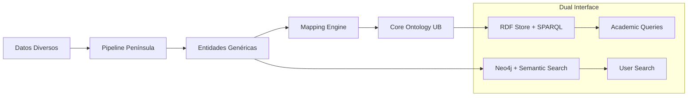

# UB/Peninsula First Drafts - Comparative Entity Mapping

**Análisis comparativo de entidades entre aproximaciones manual (UB) y automatizada (Península)**

---

## Resumen Ejecutivo

Este documento mapea las entidades específicas de dominio creadas por la Universidad de Barcelona para los proyectos **Cultura y Censura** y **SIDBRINT** con los **6 tipos de entidades genéricas** del sistema automatizado de Península.

### Metodologías Comparadas:
- **UB Manual**: 37 clases específicas de dominio (15 Censura + 25 SIDBRINT)
- **Península Automatizada**: 6 tipos genéricos adaptables

---

## 1. Mapeo de Entidades - Cultura y Censura

### 1.1 Entidades UB → Península

| **Clase UB (OWL)** | **Dominio** | **Península Tipo** | **Justificación del Mapeo** |
|-------------------|-------------|-------------------|----------------------------|
| `:Expediente` | Documentos archivísticos | **Document** | Registros oficiales con metadatos |
| `:LibroPresentado` | Obras para censura | **Document** | Documentos sometidos a revisión |
| `:LibroPublicado` | Obras publicadas | **Document** | Publicaciones con metadatos |
| `:Autor` | Autores y escritores | **Person** | Individuos históricos |
| `:Lector` | Censores oficiales | **Person** | Individuos con roles específicos |
| `:Importador` | Importadores | **Person** | Individuos/empresas importadoras |
| `:Editor` | Casas editoriales | **Organization** | Instituciones editoras |
| `:ProveedorDePapel` | Proveedores | **Organization** | Empresas proveedoras |
| `:Coleccion` | Colecciones bibliográficas | **Concept** | Agrupaciones temáticas |
| `:Idioma` | Idiomas de publicación | **Concept** | Categorías conceptuales |
| `:InformeDeLector` | Informes de censura | **Document** | Documentos de evaluación |
| `:SolicitudDeImportacion` | Solicitudes | **Document** | Documentos administrativos |
| `:SolicitudDePublicacion` | Solicitudes | **Document** | Documentos administrativos |
| `:FirmaLector` | Firmas censores | **Event** | Acciones de validación |
| `:TachaduraYEnmienda` | Modificaciones | **Event** | Acciones de edición |

### 1.2 Propiedades y Relaciones - Censura

#### Relaciones Documentales UB → Península
```turtle
# UB Específico
:tieneAutor a owl:ObjectProperty ; 
    rdfs:domain :LibroPublicado ; 
    rdfs:range :Autor .
```

```cypher
// Península Genérico
(:Document)-[:AUTHORED]->(:Person)
(:Document)-[:MENTIONS]->(:Concept)
```

#### Relaciones Institucionales
```turtle
# UB Específico  
:realizaSolicitud a owl:ObjectProperty ; 
    rdfs:domain :Editor ; 
    rdfs:range :SolicitudDePublicacion .
```

```cypher
// Península Genérico
(:Organization)-[:PARTICIPATED_IN]->(:Event)
(:Person)-[:BELONGS_TO]->(:Organization)
```

---

## 2. Mapeo de Entidades - SIDBRINT

### 2.1 Entidades UB → Península

| **Clase UB (OWL)** | **Dominio** | **Península Tipo** | **Justificación del Mapeo** |
|-------------------|-------------|-------------------|----------------------------|
| `:Brigadistes` | Brigadistas internacionales | **Person** | Individuos históricos centrales |
| `:Professions` | Profesiones | **Concept** | Categorías de actividad |
| `:Països` | Países | **Location** | Entidades geográficas administrativas |
| `:Llocs` | Lugares geográficos | **Location** | Municipios, comarcas, provincias |
| `:EscenarisBèlics` | Escenarios bélicos | **Site** | Sitios históricos específicos |
| `:TipusEscenaris` | Tipos de escenarios | **Concept** | Clasificaciones temáticas |
| `:Esdeveniments` | Acontecimientos | **Event** | Eventos históricos |
| `:TipusEsdeveniments` | Tipos de eventos | **Concept** | Clasificaciones de eventos |
| `:EstructuresMilitars` | Estructuras militares | **Organization** | Unidades organizacionales |
| `:TipusEstructures` | Tipos de estructuras | **Concept** | Clasificaciones militares |
| `:Organitzacions` | Organizaciones | **Organization** | Instituciones políticas/sociales |
| `:IdeologiesPolítiques` | Ideologías | **Concept** | Ideas y movimientos |
| `:ProcedènciaReligióÈtnia` | Características | **Concept** | Categorías identitarias |
| `:FontsDocumentals` | Fuentes documentales | **Document** | Registros archivísticos |
| `:Enfocaments` | Enfoques | **Concept** | Perspectivas analíticas |
| `:LiteraturaMitjansComunicacio` | Literatura/Medios | **Concept** | Categorías culturales |
| `:Cultura` | Cultura | **Concept** | Ámbitos culturales |
| `:TipusDocumental` | Tipos documentales | **Concept** | Clasificaciones de documentos |
| `:Idiomes` | Idiomas | **Concept** | Categorías lingüísticas |
| `:Moviments` | Movimientos | **Organization** | Movimientos políticos/sociales |

### 2.2 Entidades Asociativas (Many-to-Many)

| **Tabla UB** | **Función** | **Mapeo Península** |
|--------------|-------------|-------------------|
| `BRIGADISTES_PROFESSIONS` | Brigadista-Profesión | `(:Person)-[:ASSOCIATED_WITH]->(:Concept)` |
| `BRIGADISTES_ESCENARIS_BELLICS` | Brigadista-Escenario | `(:Person)-[:PARTICIPATED_IN]->(:Site)` |
| `BRIGADISTES_ESDEVENIMENTS` | Brigadista-Evento | `(:Person)-[:PARTICIPATED_IN]->(:Event)` |
| `BRIGADISTES_ESTRUCTURES` | Brigadista-Estructura | `(:Person)-[:SERVED_IN]->(:Organization)` |
| `BRIGADISTES_ORGANITZACIONS` | Brigadista-Organización | `(:Person)-[:BELONGS_TO]->(:Organization)` |
| `LLOCS_ESCENARIS` | Lugar-Escenario | `(:Site)-[:LOCATED_IN]->(:Location)` |
| `FONTS_BRIGADISTES` | Fuente-Brigadista | `(:Document)-[:DOCUMENTS]->(:Person)` |

---

## 3. Análisis de Cobertura por Tipo de Entidad

### 3.1 Distribución de Entidades UB por Tipo Península

| **Tipo Península** | **Censura** | **SIDBRINT** | **Total** | **% Cobertura** |
|-------------------|-------------|--------------|-----------|----------------|
| **Person** | 4 | 1 | 5 | 13.5% |
| **Document** | 6 | 1 | 7 | 18.9% |
| **Organization** | 2 | 3 | 5 | 13.5% |
| **Location** | 0 | 2 | 2 | 5.4% |
| **Site** | 0 | 1 | 1 | 2.7% |
| **Event** | 2 | 1 | 3 | 8.1% |
| **Concept** | 3 | 16 | 19 | 51.4% |

**Observación**: El 51.4% de las entidades UB son categorizaciones conceptuales, mientras que Península enfatiza entidades concretas (Person, Document, Organization).

### 3.2 Complejidad de Relaciones

#### UB - Relaciones Específicas (Ejemplos)
```turtle
# Censura - 20+ relaciones explícitas
:tieneAutor owl:inverseOf :esAutorDe .
:perteneceAColeccion owl:inverseOf :incluyeLibro .
:realizaSolicitud owl:inverseOf :esSolicitadoPor .

# SIDBRINT - 25+ relaciones explícitas  
:hasPaïsos owl:inverseOf :isPaïsosOf .
:hasTipusEscenaris owl:inverseOf :hasLlocs .
:hasMoviments owl:inverseOf :hasBrigadistes .
```

#### Península - Relaciones Genéricas
```cypher
// 7 tipos de relaciones principales
(:Person)-[:BELONGS_TO|:SERVED_IN|:PARTICIPATED_IN]->(:Organization|:Event)
(:Document)-[:DOCUMENTS|:AUTHORED|:MENTIONS]->(:Person|:Concept)
(:Site)-[:LOCATED_IN]->(:Location)
(:Location)-[:PART_OF]->(:Location)
```

---

## 4. Ventajas y Limitaciones del Mapeo

### 4.1 Ventajas de la Aproximación Península

**✅ Simplicidad arquitectural:**
- 6 tipos vs 37 clases específicas
- Menor complejidad de mantenimiento
- Adaptabilidad cross-domain

**✅ Flexibilidad de propiedades:**
- Propiedades dinámicas vs esquema fijo
- Adaptación automática a nuevos datos
- No requiere rediseño ontológico

**✅ Escalabilidad:**
- Procesamiento automatizado
- Integración multi-formato
- Expansión sin intervención manual

### 4.2 Limitaciones del Mapeo

**❌ Pérdida de especificidad semántica:**
- `:Lector` (censor) vs `:Autor` → ambos `Person`
- `:LibroPublicado` vs `:Expediente` → ambos `Document`
- `:EstructuraMilitar` vs `:Organitzacio` → ambos `Organization`

**❌ Simplificación de relaciones:**
- `realizaSolicitud` → genérica `PARTICIPATED_IN`
- `perteneceAColeccion` → genérica `ASSOCIATED_WITH`
- Pérdida de matices semánticos específicos

**❌ Agregación conceptual:**
- 19 conceptos UB → 1 tipo `Concept`
- Pérdida de jerarquías ontológicas
- Menor precisión en reasoning formal

---

## 5. Casos de Uso Comparativos

### 5.1 Consulta: "Autores censurados en Barcelona"

#### Enfoque UB (Formal)
```sparql
SELECT ?autor ?libro ?expediente WHERE {
    ?autor a :Autor ;
           :esAutorDe ?libro .
    ?libro a :LibroPresentado ;
           :seRefiereMunicipio "Barcelona" .
    ?expediente a :Expediente ;
                :contiene ?libro .
}
```

#### Enfoque Península (Semántica)
```cypher
MATCH (p:Person)-[:AUTHORED]->(d:Document)
WHERE d.content CONTAINS "Barcelona" 
  AND d.type CONTAINS "censura"
RETURN p.name, d.title, d.location
```

### 5.2 Consulta: "Brigadistas en batallas de Aragón"

#### Enfoque UB (Formal)
```sparql
SELECT ?brigadista ?batalla ?estructura WHERE {
    ?brigadista a :Brigadistes ;
                :hasEscenarisBèlics ?escenari .
    ?escenari a :EscenarisBèlics ;
              :hasLlocs ?lloc .
    ?lloc a :Llocs ;
          :província "Aragón" .
}
```

#### Enfoque Península (Semántica)
```cypher
MATCH (p:Person)-[:PARTICIPATED_IN]->(s:Site)-[:LOCATED_IN]->(l:Location)
WHERE l.name CONTAINS "Aragón" 
  AND s.type CONTAINS "batalla"
RETURN p.full_name, s.name, l.coordinates
```

---

## 6. Métricas de Transformación

### 6.1 Reducción de Complejidad

| **Métrica** | **UB Total** | **Península** | **Reducción** |
|-------------|--------------|---------------|---------------|
| **Clases** | 37 | 6 | 83.8% |
| **Propiedades** | 80+ | ~20 | 75.0% |
| **Relaciones** | 45+ | 7 tipos | 84.4% |
| **Reglas** | 4 específicas | Automáticas | 100% |

### 6.2 Cobertura Funcional

| **Funcionalidad** | **UB** | **Península** |
|-------------------|--------|---------------|
| **Precisión semántica** | 100% | 75-85% |
| **Flexibilidad datos** | Baja | Alta |
| **Mantenimiento** | Manual | Automático |
| **Interoperabilidad** | W3C/LOD | REST/GraphQL |

---

## 7. Recomendaciones para HerStory

### 7.1 Estrategia Híbrida Propuesta

**Fase 1: Core Ontology (UB)**
- Definir 10-15 clases esenciales para el dominio
- Mantener relaciones críticas específicas
- Garantizar compliance W3C/LOD

**Fase 2: Automated Processing (Península)** 
- Pipeline para nuevas fuentes heterogéneas
- Mapeo automático a core ontology
- Búsqueda semántica para usuarios

### 7.2 Arquitectura Recomendada



**Beneficios:**
- **Académicos**: Precisión formal + reasoning
- **Usuarios**: Búsqueda natural + flexibilidad
- **Investigadores**: Ambos paradigmas según necesidad

---

## 8. Conclusiones

### 8.1 Complementariedad de Enfoques

| **Aspecto** | **UB Manual** | **Península Automatizada** |
|-------------|---------------|---------------------------|
| **Precisión** | Máxima (100%) | Alta (75-85%) |
| **Cobertura** | Dominio específico | Cross-domain |
| **Mantenimiento** | Intensivo | Automático |
| **Usabilidad** | Expertos | Usuarios generales |
| **Escalabilidad** | Limitada | Horizontal |

### 8.2 Valor Diferencial

- **UB**: Excelencia para investigación académica formal
- **Península**: Optimización para exploración y descubrimiento
- **Híbrido**: Lo mejor de ambos mundos

La aproximación combinada permite **rigor académico** sin sacrificar **usabilidad práctica** - ideal para el proyecto HerStory que debe servir tanto a investigadores especializados como al público general.

---

*Documento comparativo UB-Península*  
*HerStory Project - Ensayos*  
*Versión 1.0 - Enero 2025* 