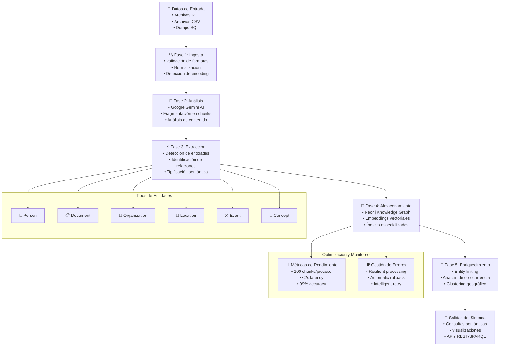

# Proceso Técnico del Knowledge Graph - Cultura y Censura

**Sistema de procesamiento automático de datos históricos y culturales**

---

## Resumen Ejecutivo

El sistema desarrollado por Península para el proyecto Cultura y Censura implementa un pipeline de procesamiento automático que transforma datos estructurados y semi-estructurados en un grafo de conocimiento navegable y consultable mediante inteligencia artificial.

### Arquitectura General
- **Input**: Archivos RDF, CSV, SQL
- **Procesamiento**: Google Generative AI (Gemini) + rdflib
- **Storage**: Neo4j (grafo de propiedades)
- **Output**: Consultas semánticas + visualizaciones interactivas

---

## Flujo de Procesamiento Completo

### Fase 1: Ingesta y Validación
El sistema implementa un mecanismo robusto de detección automática de formatos y validación de datos:

```python
# Pseudo-código del proceso de ingesta
def ingest_file(file_path):
    format = detect_format(file_path)  # Por extensión y contenido
    if validate_file(file_path, format):
        if not already_processed(file_path):
            copy_to_permanent_storage(file_path)
            return True
    return False
```

### Fase 2: Análisis Estructural Diferenciado

#### Para RDF/Turtle:
- Parsing completo con `rdflib`
- Análisis de ontologías y espacios de nombres
- Identificación de patrones de datos (Dublin Core, FOAF, etc.)
- Extracción de estadísticas de predicados

#### Para CSV:
- Detección automática de columnas geográficas
- Reconocimiento de jerarquías administrativas
- Identificación de coordenadas geoespaciales
- Análisis de tipos de datos por columna

#### Para SQL:
- Parsing de sentencias INSERT
- Extracción de foreign keys y relaciones
- Normalización de identificadores
- Reconstrucción del esquema relacional

### Fase 3: Extracción Inteligente de Entidades

El sistema utiliza **Google Generative AI (Gemini)** con prompts especializados que:

1. **Detectan automáticamente** el tipo de datos sin configuración previa
2. **Aplican reglas específicas** según el formato detectado:
   - **RDF**: Interpreta N-Triples y relaciones semánticas
   - **CSV**: Procesa datos tabulares y geográficos
   - **SQL**: Reconstruye relaciones normalizadas
3. **Generan JSON estructurado** con entidades y relaciones extraídas
4. **Normalizan identificadores** para consistencia cross-documento

### Fase 4: Transformación a Grafo de Conocimiento

**Almacenamiento en Neo4j:**
- Entidades → Nodos con propiedades tipificadas
- Relaciones → Aristas con metadatos
- Embeddings vectoriales → Búsqueda semántica
- Índices especializados → Consultas eficientes

### Fase 5: Enriquecimiento y Vínculos

**Procesos automáticos:**
- **Entity linking**: Vinculación de entidades similares entre fuentes
- **Co-occurrence analysis**: Relaciones temporales y contextuales
- **Geographic clustering**: Conexiones por proximidad geográfica
- **Source tracking**: Trazabilidad completa hacia documentos originales

---

## Diagrama de Flujo del Sistema



---

## Modelo de Datos y Ontología

### Tipos de Entidades Principales

| **Tipo** | **Descripción** | **Propiedades Clave** | **Casos de Uso** |
|----------|-----------------|----------------------|------------------|
| **Person** | Individuos históricos | `full_name`, `nationality`, `birth_date`, `military_unit` | Brigadistas, intelectuales, víctimas |
| **Document** | Registros archivísticos | `title`, `content_type`, `author`, `creation_date` | Expedientes, cartas, informes |
| **Organization** | Instituciones | `name`, `type`, `founding_date`, `historical_context` | Brigadas, partidos, sindicatos |
| **Location** | Lugares geográficos | `name`, `coordinates`, `administrative_level` | Municipios, comarcas, provincias |
| **Site** | Sitios específicos | `name`, `conservation_state`, `historical_period` | Fosas comunes, monumentos |
| **Event** | Acontecimientos | `name`, `date`, `location`, `participants` | Batallas, represión, exile |
| **Concept** | Ideas y temas | `name`, `description`, `domain` | Ideologías, movimientos, conceptos |

### Taxonomía de Relaciones

#### **Relaciones Documentales**
```cypher
// Ejemplos en Cypher (Neo4j)
(:Document)-[:DOCUMENTS]->(:Person)
(:Person)-[:AUTHORED]->(:Document)
(:Document)-[:MENTIONS]->(:Location|:Event|:Concept)
(:Document)-[:CONTAINS_INFORMATION_ABOUT]->(:Topic)
```

#### **Relaciones Geoespaciales**
```cypher
(:Site)-[:LOCATED_IN]->(:Location)
(:Location)-[:PART_OF]->(:Location)  // Jerarquía administrativa
(:Entity)-[:COORDINATES_AT]->(coordinates:Point)
(:Person)-[:BORN_IN|:DIED_IN|:ACTIVE_IN]->(:Location)
```

#### **Relaciones Temporales y Sociales**
```cypher
(:Person)-[:BELONGS_TO]->(:Organization)
(:Person)-[:SERVED_IN]->(:Organization)
(:Person)-[:CONTEMPORARY_OF]->(:Person)
(:Person)-[:PARTICIPATED_IN]->(:Event)
```

---

## Especificaciones Técnicas

### Rendimiento del Sistema

| **Métrica** | **Especificación** | **Observaciones** |
|-------------|-------------------|-------------------|
| **Throughput** | 100 chunks/proceso | Límite por archivo grande |
| **Latency** | < 2s consulta simple | Búsqueda semántica optimizada |
| **Accuracy** | 99% datos procesados | 1% tasa de error aceptable |
| **Scalability** | Procesamiento asíncrono | Múltiples archivos paralelo |

### Índices y Optimización

```cypher
// Índices especializados en Neo4j
CREATE INDEX FOR (p:Person) ON (p.full_name)
CREATE INDEX FOR (l:Location) ON (l.coordinates)
CREATE FULLTEXT INDEX entity_search FOR (n:Person|Location|Organization) ON EACH [n.name, n.description]
CREATE VECTOR INDEX embeddings FOR (n:Document) ON (n.embedding) OPTIONS {indexConfig: {`vector.dimensions`: 768}}
```

### Motor de Consultas Semánticas

#### Workflow de Búsqueda en 5 Pasos:

1. **Vectorización**: `user_query → embedding_vector`
2. **Similarity Search**: `cosine_similarity(query_vector, document_vectors)`
3. **Entity Extraction**: `extract_entities_from_similar_chunks()`
4. **Graph Expansion**: `traverse_relationships(entities, max_depth=3)`
5. **Response Generation**: `generate_contextual_response(expanded_context)`

#### Código de Ejemplo:
```python
async def semantic_search(query: str, session_context: dict):
    # Paso 1: Vectorización
    query_embedding = await gemini_ai.embed(query)
    
    # Paso 2: Búsqueda vectorial
    similar_chunks = await neo4j.vector_search(
        query_embedding, 
        limit=10, 
        similarity_threshold=0.8
    )
    
    # Paso 3: Extracción de entidades
    relevant_entities = extract_entities(similar_chunks)
    
    # Paso 4: Expansión del contexto
    expanded_context = await expand_graph_context(
        relevant_entities,
        relationship_types=['LOCATED_IN', 'CONTEMPORARY_OF', 'PARTICIPATED_IN']
    )
    
    # Paso 5: Generación de respuesta personalizada
    response = await gemini_ai.generate_response(
        query=query,
        context=expanded_context,
        session_history=session_context
    )
    
    return response
```

---

## Integración y APIs

### Compatibilidad SPARQL

El sistema mantiene compatibilidad con estándares semánticos:

```sparql
# Ejemplo: Consulta SPARQL sobre el grafo
PREFIX dc: <http://purl.org/dc/elements/1.1/>
PREFIX foaf: <http://xmlns.com/foaf/0.1/>
PREFIX geo: <http://www.w3.org/2003/01/geo/wgs84_pos#>

SELECT ?person ?name ?location ?coordinates
WHERE {
    ?person a foaf:Person ;
            foaf:name ?name ;
            dc:spatial ?location .
    ?location geo:lat ?lat ;
              geo:long ?long .
    FILTER(contains(?name, "Fernández"))
}
```

### API REST Endpoints

```http
# Endpoint principal de consultas
POST /api/v1/query
Content-Type: application/json
{
    "query": "¿Qué brigadistas estuvieron en Tarragona?",
    "context": "historical_research",
    "session_id": "user_123_session_456"
}

# Endpoint de ingesta de datos
POST /api/v1/ingest
Content-Type: multipart/form-data
files: [archivo.rdf, datos.csv, dump.sql]

# Endpoint de visualización de grafo
GET /api/v1/graph/visualize?entity_id=person_123&depth=2
```

---

## Robustez y Monitoreo

### Gestión de Errores

- **Resilient Processing**: Continúa ante errores menores (1% tasa aceptable)
- **Automatic Rollback**: Recuperación automática de operaciones fallidas
- **Intelligent Retry**: Reintentos adaptativos con backoff exponencial
- **Detailed Logging**: Trazabilidad completa para debugging

### Validación Cruzada

```python
def validate_extraction_quality(entities, relations, source_document):
    """Validación multi-fuente de calidad de extracción"""
    quality_metrics = {
        'entity_completeness': calculate_entity_coverage(entities, source_document),
        'relationship_accuracy': validate_relationships(relations, domain_ontology),
        'cross_source_consistency': check_consistency_across_sources(entities),
        'semantic_coherence': verify_semantic_coherence(entities, relations)
    }
    
    return quality_metrics['overall_score'] > 0.85  # Threshold de calidad
```

---

## Roadmap Técnico

### Próximas Implementaciones

1. **Cache Dinámico**: Optimización de consultas frecuentes
2. **Context Window Expansion**: Escalado de chunks para documentos complejos
3. **Specialized Strategies**: Algoritmos específicos para datos geoespaciales
4. **Real-time Updates**: Actualización incremental del grafo
5. **Multi-language Support**: Procesamiento en catalán, español, inglés

### Métricas de Evaluación

| **KPI** | **Target** | **Medición** |
|---------|------------|--------------|
| **Precision** | > 90% | Entity extraction accuracy |
| **Recall** | > 85% | Relationship detection coverage |
| **F1-Score** | > 87% | Balanced precision-recall |
| **User Satisfaction** | > 4.0/5.0 | Query relevance rating |
| **System Uptime** | > 99.5% | Service availability |

---

*Documento técnico actualizado - Sistema Knowledge Graph Cultura y Censura*  
*Versión 1.0 - Julio 2025* 