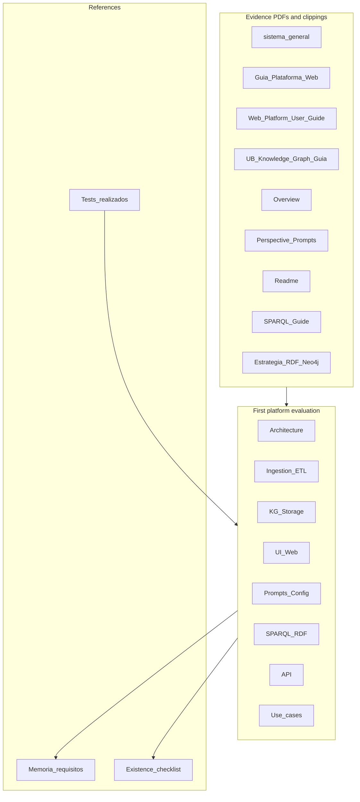

# Plan: Evaluación primera plataforma (entrega Peninsula)

## Objetivo

Incorporar en [[Protocolo de evaluación de la entrega de Península - sobre requerimientos]] una **evaluación de primera plataforma** que:

1. Use los PDFs de Peninsula (y sus clippings) como **fuentes de evidencia**.
2. Evalúe la plataforma entregada (UBXAT/neoRAG) frente a los **requisitos** de la Memoria técnica y al **Existence checklist**.
3. Produzca una evaluación repetible y trazable (criterio + fuente + resultado).

---

## Documentos fuente – disponibilidad en el vault

| PDF (Peninsula)                                                    | Markdown / clipping                                   | Qué dicen (resumen)                                                                                                                                                                                                                                                                                                                                                                                                                                                                                                                                                         |
| ------------------------------------------------------------------ | ----------------------------------------------------- | --------------------------------------------------------------------------------------------------------------------------------------------------------------------------------------------------------------------------------------------------------------------------------------------------------------------------------------------------------------------------------------------------------------------------------------------------------------------------------------------------------------------------------------------------------------------------- |
| sistema_general.pdf                                                | [[Sistema general - Cultura y Censura KG]]            | Flujo: ingesta RDF/CSV/SQL → análisis estructural (rdflib, headers) → extracción Gemini → Neo4j (embeddings, índices vectoriales) → indexación y vínculos cruzados. Tipos de entidades/relaciones; motor de consultas (búsqueda semántica, navegación de grafo); chunks (límite 100); visualización y robustez.                                                                                                                                                                                                                                                             |
| Guia Plataforma Web (ES).pdf                                       | [[Guia Plataforma Web (ES)]]                          | Interfaz: cuatro módulos (Agente, Grafo de Conocimiento, SPARQL, Ingestar); panel lateral y cabecera. Agente: consulta en lenguaje natural, evaluación de confianza (verde/amarillo/rojo), chips de fuentes, métricas de rendimiento, historial. Grafo: nodos por color (rojo=personal, azul=localizaciones/eventos, verde=documentación, naranja=fosas); pan/zoom; panel de control. SPARQL: biblioteca de consultas predefinidas; resultados JSON. Ingestar: SQL/CSV/JSON, configuración ETL, monitorización; registro de archivos y estado. Estado API y sincronización. |
| Web Platform User Guide (EN).pdf                                   | [[Web Platform User Guide (EN)]]                      | Mismo contenido que Guía Plataforma Web (ES) en inglés: Agent, Knowledge Graph, SPARQL, Ingestion modules; sidebar/header; confidence, source chips, performance metrics; node colours; predefined SPARQL library; ETL config and monitoring.                                                                                                                                                                                                                                                                                                                               |
| UB - Knowledge Graph - Guia Configuracion de Prompt - 12062025.pdf | [[HerStory/Técnica de inv/UB Knowledge graph - Guía]] | Configuración de prompts: reglas de extracción personalizadas, instrucciones para relaciones, foco de entidades (Person, Document, Organization, Location, Site, Concept, Event), tipos de relaciones habilitadas; presets (A1 máximas relaciones, Mapas geográficos, Red social histórica, Quien escribió qué); UI "Configurar Prompt".                                                                                                                                                                                                                                    |
| UBXAT - General Platform Overview (EN).pdf                         | [[Clippings/UBXAT - General Platform Overview (EN)]]  | ETL cognitivo, ingesta zero-config (SQL, CSV, RDF), Gemini, Wikidata, Neo4j Aura; casos de uso (Brigadas Internacionales, Fosas comunes); beneficios (tiempo, accesibilidad, reproducibilidad).                                                                                                                                                                                                                                                                                                                                                                             |
| UBXAT - Perspective & Prompts (EN).pdf                             | [[UBXAT - Perspective and Prompts (EN)]]              | Conceptos unificados género-neutral (Author P50, Person Q5, Brigadista); género vía P21 (sex or gender); consultas por género en lenguaje natural, SPARQL y Cypher; prompt engineering para /api/v1/chat (detección de términos de género, contexto mejorado); ground truth (sidbrint_consolidated_wikidata_mapping.json, autor_wikidata_mapping.json); ejemplos (contar mujeres brigadistas, documentos por autoras, distribución por país); troubleshooting.                                                                                                              |
| UBXAT - Readme (EN).pdf                                            | [[Clippings/UBXAT - Readme (EN)]]                     | Arquitectura (LangGraph, FastAPI), CLI/API, config (default.yaml, .env), ground truth en JSON; endpoints ETL, SPARQL, chat.                                                                                                                                                                                                                                                                                                                                                                                                                                                 |
| UBXAT - SPARQL Integration Guide (EN).pdf                          | [[Clippings/UBXAT SPARQL (EN)]]                       | Endpoint POST /api/v1/sparql; traducción SPARQL→Cypher; SELECT/ASK/COUNT; resolución de variables con ground truth (Q5, Q108163, Q49848, etc.); ejemplos curl.                                                                                                                                                                                                                                                                                                                                                                                                              |
| UBXAT_-_Estrategia_RDF_Neo4j.pdf                                   | [[Clippings/UBXAT_-_Estrategia_RDF_Neo4j]]            | Flujos RDF↔Neo4j; ingesta RDF (loader, Gemini, Neo4j); consulta SPARQL sobre Neo4j (SELECT, ASK, CONSTRUCT, DESCRIBE); transformaciones ontológicas; capas (almacenamiento, extracción, consulta RDF/SPARQL).                                                                                                                                                                                                                                                                                                                                                               |

---

## Evaluaciones nombradas en la literatura (Clippings)

Evaluaciones, marcos y métodos de evaluación citados en la literatura que tienen clipping en la carpeta Clippings. Enlazar siempre al archivo .md indicado para consultar el contenido.

| Evaluación / marco / método                                                                             | Clipping (.md)                                                                                                        | Descripción breve                                                                                                                                                         |
| ------------------------------------------------------------------------------------------------------- | --------------------------------------------------------------------------------------------------------------------- | ------------------------------------------------------------------------------------------------------------------------------------------------------------------------- |
| **Técnicas y métodos para evaluar sistemas de IA simbiótica centrados en el usuario**                   | [[Techniques and Methods to Evaluate Human-Centered Symbiotic AI Systems]]                                            | Marco de evaluación y métricas para Symbiotic AI (SAI); integración de métricas UX y de IA; estudios de usabilidad y estudios in situ (Calvano, IUI 2025).                |
| **Recomendaciones para la realización de pruebas de usuario**                                           | [[EuropeanaConnect Deliverable 3.2.3 – Recommendations for Conducting User Tests]]                                    | Recomendaciones para conducir user tests en contexto EuropeanaConnect (Rasmussen et al., 2011).                                                                           |
| **Evaluación de usabilidad de un sistema recomendador basado en grafo de conocimiento (mixed methods)** | [[Usability Evaluation of a Knowledge Graph–Based Dementia Care Intelligent Recommender System Mixed Methods Study]]  | Diseño de métodos mixtos convergentes; Computer System Usability Questionnaire; entrevistas semiestructuradas; análisis temático inductivo (Leng et al., JMIR 2023).      |
| **AI Assessment Scale (AIAS) – marco para evaluación educativa**                                        | [[The AI Assessment Scale Revisited_ A Framework for Educational Assessment]]                                         | Escala de cinco niveles de integración de GenAI en la evaluación; diálogo educador–estudiante; validez de la evaluación (Perkins, Roe, Furze, 2024).                      |
| **Diseño, realización y evaluación de usuarios del sistema ARCA (biblioteca digital)**                  | [[Design, realization, and user evaluation of the ARCA system for exploring a digital library]]                       | Diseño centrado en el usuario; evaluación incremental de dos releases; prueba comparativa con otros sistemas de recuperación de información (Bernasconi et al., 2022).    |
| **Evaluación de sistemas de organización del conocimiento desde una perspectiva de género**             | [[Assessing knowledge organization systems from a gender perspective Wikipedia taxonomy]]                             | Métodos heurísticos y de inspección; criterios de evaluación para categorización por género; taxonomía Wikipedia y ontologías Wikidata (Centelles & Ferran-Ferrer, 2024). |
| **Evaluación de usabilidad y ciberseguridad de sistemas de IA mediante diseño centrado en el usuario**  | [[Assessing Usability and Cybersecurity of AI Systems through the Human-Centered Design]]                             | Enfoque HCD para evaluar usabilidad y ciberseguridad de sistemas de IA; componentes HCI, Ciberseguridad, Ética y Derecho (Calvano et al., 2025).                          |
| **Diseño y evaluación de sistemas de IA simbólica de alta calidad**                                     | [[Design and evaluation of high-quality simbolic AI systems]]                                                         | Guías y métricas para diseñar y evaluar Symbiotic AI (SAI); enfoque human-centered; estudios con usuarios (Calvano, 2024).                                                |
| **Evaluación por doctorandos de un grafo de conocimiento de compartición de información**               | [[It answers questions that I didn't know I had" PhD students' evaluation of an information sharing knowledge graph]] | Evaluación por estudiantes de doctorado de un sistema de grafo de conocimiento para compartir información (Gardasevic & Lamba, 2024).                                     |
| **Evaluación de usabilidad – análisis bibliométrico (usability testing)**                               | [[Usability Testing  A Bibliometric Analysis Based on WoS Data – Journal of Scientometric Research]]                  | Análisis bibliométrico de la literatura sobre usability testing (WoS).                                                                                                    |
| **Modelo de experiencia de usuario Aware y heurísticas derivadas**                                      | [[The Aware User Experience Model, Its Method of Construction and Derived Heuristics]]                                | Modelo de UX y método de construcción; heurísticas derivadas para evaluación.                                                                                             |
| **Evaluación de la investigación mediante indicadores scientométricos**                                 | [[The Evaluation of Research by Scientometric Indicators]]                                                            | Uso de indicadores scientométricos para evaluar la investigación.                                                                                                         |
| **Conceptualización y evaluación de la calidad de datos conductuales digitales**                        | [[Conceptualizing, Assessing, and Improving the Quality of Digital Behavioral Data]]                                  | Marco para conceptualizar, evaluar y mejorar la calidad de datos conductuales digitales.                                                                                  |

*Estas referencias pueden usarse para alinear el protocolo de evaluación de primera plataforma con marcos y métodos ya establecidos en la literatura (evaluación de sistemas centrados en el usuario, usabilidad, métodos mixtos, evaluación de KOS/grafos de conocimiento, escalas de evaluación de IA).*

---

## Estructura propuesta para el protocolo

Insertar una nueva sección **"Evaluación de primera plataforma"** (o título equivalente) después de los enlaces existentes, con:

### 2. Dimensiones de evaluación (mapeadas a PDFs)

Agrupar criterios por dimensión y vincular cada una al/los PDF(s) que la describen o implican:

- **Arquitectura y flujo de datos**  
  Fuentes: [[Sistema general - Cultura y Censura KG]], UBXAT General Platform Overview, UBXAT Readme, Estrategia RDF Neo4j.  
  Criterios (según documentos): Pipeline ETL cognitivo (entrada → análisis estructural RDF/CSV → Gemini → Neo4j con embeddings e índices vectoriales → indexación y vínculos cruzados); estrategia RDF↔Neo4j; papel de LangGraph/orquestación; límite de chunks (100 por proceso); procesamiento asíncrono, detección de duplicados, normalización de IDs.

- **Ingesta y ETL**  
  Fuentes: Sistema general, Overview, Readme, Estrategia RDF Neo4j, [[Guia Plataforma Web (ES)]] / [[Web Platform User Guide (EN)]].  
  Criterios: Auto-detección de formato (SQL, CSV, RDF) por extensión y contenido; validación y copia en directorio permanente; mapeo guiado por ground truth; ingesta zero/low-config; soporte SQL/CSV/JSON en interfaz; configuración ETL (detección automática, batch size); monitorización en tiempo real; registro de archivos (nombre, tipo, peso, fecha) y estado (En progreso, Completados, Fallidos).

- **Grafo de conocimiento y almacenamiento**  
  Fuentes: Sistema general, Overview, Readme, Estrategia RDF Neo4j.  
  Criterios: Neo4j como almacén principal; entidades → nodos Entity con propiedades; relaciones → aristas tipificadas; embeddings por chunk (Google AI); índices vectoriales para búsqueda semántica; tipos de entidades (Person, Document, Organization, Location, Site, Concept, Event) y relaciones (DOCUMENTS, AUTHORED, BELONGS_TO, LOCATED_IN, etc.); estructura compatible con Wikidata.

- **Interfaz de usuario (plataforma web)**  
  Fuentes: [[Guia Plataforma Web (ES)]], [[Web Platform User Guide (EN)]].  
  Criterios: Cuatro módulos operativos (Agente, Grafo de Conocimiento, SPARQL, Ingestar); panel lateral y cabecera; Agente: consulta en lenguaje natural, evaluación de confianza (verde/amarillo/rojo), chips de fuentes, métricas de rendimiento, historial (copiar, reiniciar sesión); Grafo: nodos por color (rojo=personal/brigadistas, azul=localizaciones/eventos, verde=documentación, naranja=fosas), pan/zoom, panel de control con estadísticas; SPARQL: biblioteca de consultas predefinidas, resultados JSON, copia rápida; Ingestar: carga SQL/CSV/JSON, configuración ETL, monitorización; estado API y sincronización; recomendaciones de uso.

- **Prompts y configuración de extracción**  
  Fuentes: [[HerStory/Técnica de inv/UB Knowledge graph - Guía]], [[UBXAT - Perspective and Prompts (EN)]].  
  Criterios: Reglas de extracción personalizadas; foco de entidades (Person, Document, Organization, Location, Site, Concept, Event); tipos de relaciones habilitadas; presets (A1 máximas relaciones, Mapas geográficos, Red social histórica, Quien escribió qué); UI "Configurar Prompt"; conceptos unificados género-neutral (Author P50, Person Q5); género vía P21 (sex or gender) y ground truth (sidbrint_consolidated_wikidata_mapping.json, autor_wikidata_mapping.json); prompt engineering para /api/v1/chat (detección de términos de género, contexto mejorado); consultas por género en lenguaje natural, SPARQL y Cypher.

- **Capa SPARQL y RDF**  
  Fuentes: UBXAT SPARQL Integration Guide, Estrategia RDF Neo4j.  
  Criterios: Endpoint SPARQL (POST /api/v1/sparql); traducción SPARQL→Cypher; SELECT/ASK/COUNT; resolución de variables con ground truth (Q5, Q108163, Q49848, etc.); exportación RDF; biblioteca de consultas predefinidas (listados personas, geolocalización fosas, densidad relaciones, ASK).

- **API e integración**  
  Fuentes: Readme, Overview.  
  Criterios: API REST (FastAPI); endpoints ETL, SPARQL, chat (/api/v1/chat); CLI; env/config (default.yaml, .env).

- **Casos de uso e impacto**  
  Fuentes: Overview (Brigadas Internacionales, Fosas comunes); Guía Plataforma Web (brigadistas, fosas, Guerra Civil Española).  
  Criterios: Casos de uso documentados (Brigadas, Fosas); alineación con memòria democràtica / investigación histórica; beneficios (tiempo, accesibilidad, reproducibilidad); estudio de brigadistas internacionales y fosas comunes sin conocimientos técnicos en bases de datos.

### 3. Checklist de evaluación (orientado a requisitos)

Para cada dimensión, añadir un checklist breve que:

- Enuncie un **criterio** (p. ej. "Endpoint SPARQL documentado y accesible").
- Cite **PDF(s) fuente** (y, si aplica, clipping).
- Deje espacio para **Resultado**: Cumple / Parcial / No cumple / No evaluado.
- Opcionalmente enlace a sección de **Memoria técnica** o ítem del **Existence checklist** (p. ej. "6.3 Raonament simbòlic", "6.4 Integració").

Así la "evaluación de primera plataforma" queda ligada directamente a la lista de requisitos y al existence checklist sin duplicarlos.

### 4. Método y ejecución

- **Quién**: Evaluador(es) (p. ej. UB / PhD) con acceso a los PDFs y clippings listados y, si aplica, a la plataforma en ejecución o staging.
- **Cuándo**: Tras la entrega de documentación y (si aplica) del artefacto desplegable.
- **Cómo**: (1) Para cada dimensión, contrastar las afirmaciones con los PDFs y clippings listados; (2) rellenar resultados del checklist; (3) anotar lagunas o discrepancias entre documentación y entrega.
- **Salida**: Checklist completado en el mismo archivo del protocolo o en un anexo (p. ej. "Resultados evaluación primera plataforma – [fecha]").

### 5. Diagrama (opcional)

Un bloque mermaid puede mostrar cómo los PDFs/clippings alimentan la evaluación y cómo esta se enlaza con requisitos y pruebas:

---

## Pasos de implementación

1. **Editar el archivo del protocolo**  
   En [[Protocolo de evaluación de la entrega de Península - sobre requerimientos]]: añadir la sección "Evaluación de primera plataforma" con las subsecciones 1–4 (y opcionalmente 5) anteriores.

2. **Rellenar el checklist**  
   Para cada dimensión, añadir 3–6 criterios concretos con PDF fuente (y enlace a clipping cuando exista), placeholder de resultado y enlace opcional a Memoria/Existence checklist.

3. **Enlaces cruzados**  
   Añadir enlaces desde el protocolo a Memoria técnica (lista de requisitos + Existence checklist) y a Peninsula UBXAT - Tests realizados para que la evaluación de primera plataforma forme parte explícita de la misma cadena de evaluación. Los clippings (Sistema general - Cultura y Censura KG, Guia Plataforma Web (ES), Web Platform User Guide (EN), UBXAT - Perspective and Prompts (EN)) permiten evaluar desde markdown sin depender solo del PDF.

---

## Notas

- **Idioma**: Mantener el protocolo en español (o coherente con el archivo actual). Los criterios pueden ser frases cortas; las fuentes en inglés cuando el título del PDF sea EN.
- **Trazabilidad**: Cada criterio debe ser comprobable con al menos uno de los PDFs o clippings listados para que la evaluación sea auditable.
- **Fuentes actuales**: sistema_general, Guía Plataforma Web (ES), Web Platform User Guide (EN), UB Knowledge Graph Guía, Overview, Perspective & Prompts, Readme, SPARQL Integration Guide y Estrategia RDF Neo4j disponen de clipping en el vault; el Plan refleja el contenido que describen estos documentos (flujo ETL, interfaz de cuatro módulos, prompts y género P21, SPARQL, API, casos de uso).
